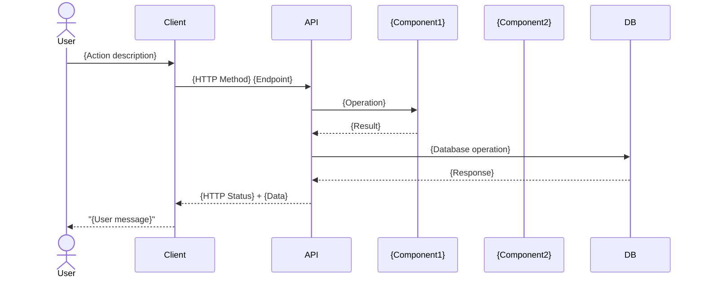

# Use Case README Template

# Use Case: {Use Case Name}

## UC-XXX: {Vietnamese Title}

### Tổng quan

{Mô tả ngắn gọn về use case - 1-2 câu về mục đích và context}

---

## Actors

- **Primary Actor**: {Main user/system interacting with feature}
- **Supporting Actors**:
  - {Supporting System 1} ({Purpose})
  - {Supporting System 2} ({Purpose})

---

## Preconditions

- {Điều kiện 1 phải thỏa mãn trước khi thực hiện}
- {Điều kiện 2 (authentication, authorization, data state, etc.)}
- {Điều kiện 3}

---

## Postconditions

### Success

- {Kết quả 1 sau khi use case thành công}
- {Kết quả 2 (database state, events published, etc.)}
- {Kết quả 3 (audit log, notifications, etc.)}

### Failure

- {Trạng thái hệ thống khi fail}
- {Loại response được trả về}
- {Logging/audit behavior}

---

## Main Flow (Happy Path)



### Steps

1. **User Input**: {Mô tả input từ user}

   - {Field 1} ({required/optional, validation})
   - {Field 2} ({constraints})

2. **Client Validation**: {Client-side checks}

   - {Validation rule 1}
   - {Validation rule 2}

3. **API Request**: {HTTP method, endpoint, headers}

4. **Authentication**: {Auth mechanism}

5. **Authorization**: {Permission checks}

6. **Input Validation**: {Server-side validation}

   - {Format checks}
   - {Business rule validations}

7. **Business Rules Check**:

   - {Rule 1 with BR reference}
   - {Rule 2 with BR reference}

8. **Data Processing**: {Key operations}

9. **Database Transaction**:

   ```sql
   BEGIN;
   {SQL statements}
   COMMIT;
   ```

10. **Event Publishing**: {Events published}

11. **Response**: {Response format with HTTP status}

---

## Alternative Flows

### A1: {Alternative Flow Name}

**Trigger**: {Condition that triggers alt flow}

**Flow**:

1. {Step where alt flow branches}
2. {HTTP Status Code}
3. Error code: {ERR_XXX_YYY}
4. Message: "{Error message}"
5. {Additional behavior}

### A2: {Another Alternative Flow}

**Trigger**: {Condition}

**Flow**:

1. {Detection point}
2. {Response status}
3. Error code: {ERR_XXX_YYY}
4. {Error details}

---

## Business Rules

### BR-001: {Rule Name}

- {Rule description}
- {Implementation details}
- {Constraints or validations}

### BR-002: {Another Rule}

- {Specific requirement}
- {Technical implementation}
- {Edge cases}

---

## Data Requirements

### Input (Request Body)

```json
{
  "field1": "type (constraints, required/optional)",
  "field2": "type (validation rules)",
  "field3": {
    "nested": "structure"
  }
}
```

### Output (Success Response)

```json
{
  "id": "type",
  "field1": "type",
  "timestamps": "iso8601",
  "metadata": {}
}
```

### Database Record

```sql
INSERT INTO {table_name} (
  {column1}, {column2}, {column3}
) VALUES (
  {value1}, {value2}, {value3}
);
```

---

## Non-Functional Requirements

### Performance

- API response time: p95 < {X} seconds
- Database operation: < {Y} ms
- {Other timing constraint}

### Security

- TLS version requirement
- Token expiry duration
- Encryption requirements
- Rate limiting: {X} requests/{timeframe} per {entity}

### Availability

- SLA: {percentage}% uptime
- Max downtime: {duration} per {period}

### Scalability

- Support {X} {entities} per {scope}
- Support {Y} concurrent requests

---

## Error Handling

| Error Code           | HTTP Status | Condition           | Message                 |
| -------------------- | ----------- | ------------------- | ----------------------- |
| ERR*{CATEGORY}*{NUM} | {status}    | {When error occurs} | "{User-facing message}" |
| ERR*{CATEGORY}*{NUM} | {status}    | {Condition}         | "{Message}"             |

---

## Test Scenarios

### Functional Tests

**Test Case 1: {Happy Path Name}**

- Input: {Test data}
- Expected: {Status code}, {Response structure}
- Verify: {Database state}, {Side effects}

**Test Case 2: {Validation Test}**

- Input: {Invalid data}
- Expected: {Error response}

### Security Tests

**Test Case {N}: {Security Scenario}**

- Input: {Attack vector or security test}
- Expected: {Proper handling}

### Performance Tests

**Test Case {N}: {Performance Scenario}**

- Load: {Concurrent requests or data volume}
- Expected: {Performance target}

---

## Dependencies

### Internal Services

- {Service 1} ({Purpose})
- {Service 2} ({Purpose})

### External Services

- {External API/Service} ({Integration point})
- None (if no external dependencies)

---

## Related Use Cases

- **UC-{NUM}**: {Related Use Case Name}
- **UC-{NUM}**: {Another Related Use Case}

---

## Change History

| Version | Date         | Author        | Changes         |
| ------- | ------------ | ------------- | --------------- |
| 1.0     | {YYYY-MM-DD} | {Team/Author} | Initial version |

---

## Notes

- {Important note 1}
- {Critical consideration 2}
- {Edge case or limitation 3}
