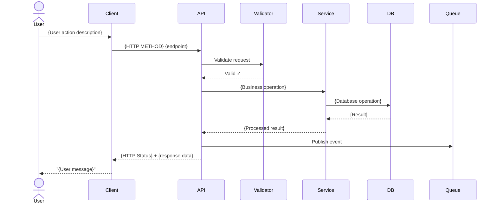
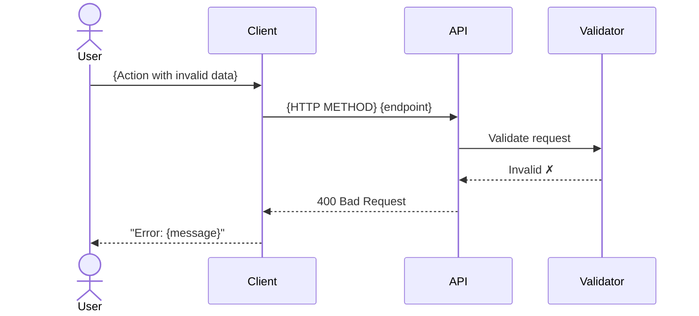
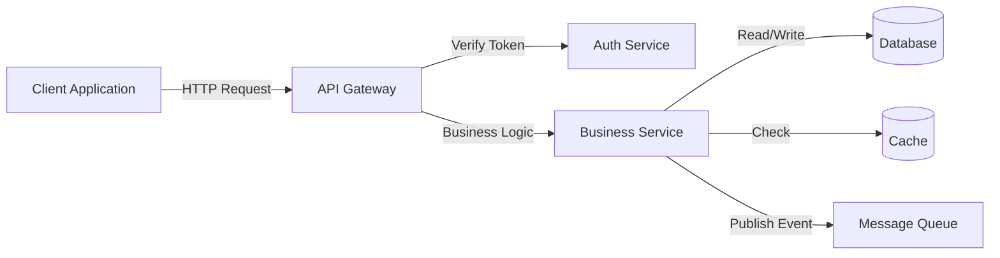

# Sequence Diagram Template

## Main Flow Diagram

## Alternative Flow: {Error Case Name}

## Component Interaction Diagram

## Notes

- Use `actor` for human users
- Use `participant` for system components
- Use `-->>` for responses (dashed line)
- Use `->>` for requests (solid line)
- Include success and failure paths
- Add activation boxes for important operations: `activate {Participant}` / `deactivate {Participant}`
