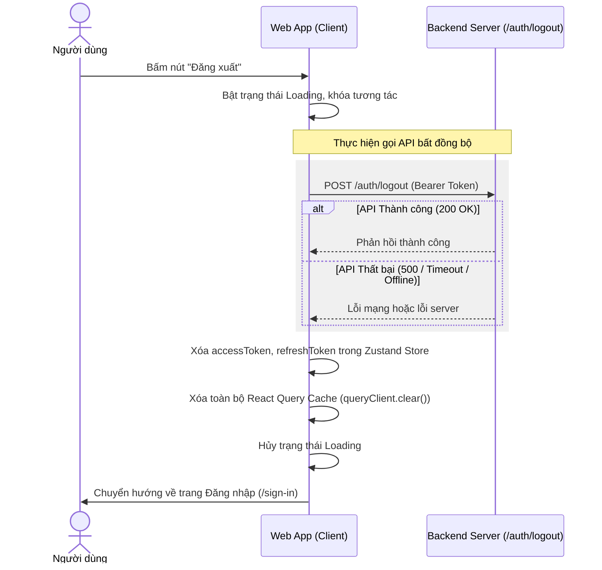

# Đặc tả tính năng Đăng xuất (Logout) & Dọn dẹp Phiên làm việc

Tài liệu này mô tả chi tiết đặc tả kỹ thuật, luồng dữ liệu, và thiết kế UI/UX cho chức năng Đăng xuất (Logout) trong hệ thống Web Travel. Tài liệu được thiết lập và chuẩn hoá theo phương pháp **\_bmad** (đề cao sự tối giản KISS, tính thực tế YAGNI, không lặp lại DRY và Tư duy nghịch đảo - Inversion Thinking).

---

## 1. Mục tiêu (Goal)

- Cung cấp phương thức đăng xuất an toàn cho người dùng (Khách hàng / Hướng dẫn viên / Quản trị viên) khỏi phiên làm việc hiện tại.
- Bảo vệ dữ liệu cá nhân bằng cách dọn dẹp triệt để tất cả các token xác thực và dữ liệu đã lưu trong cache trình duyệt.
- Mang lại trải nghiệm chuyển tiếp mượt mà, phản hồi trực quan (WOW UX) trên cả giao diện Client và Admin.

---

## 2. Đặc tả Kỹ thuật & Luồng xử lý (Technical Specifications)

Để ngăn chặn các lỗi kẹt trạng thái khi hệ thống mạng không ổn định hoặc API sập, luồng xử lý đăng xuất được thiết kế theo tư duy **Nghịch đảo (Inversion Thinking)** - ưu tiên trạng thái sạch của Client làm mục tiêu tối hậu.



### 2.1. API Endpoint

- **URL:** `POST /auth/logout` (Kế thừa từ tài liệu Swagger `https://web-travel-be.fly.dev/docs#/Auth/logout`)
- **Headers:** `Authorization: Bearer <accessToken>`
- **Phản hồi mẫu (200):**
  ```json
  {
    "data": null,
    "code": 200,
    "error": null,
    "message": "logout success"
  }
  ```

### 2.2. Xử lý Client State

1. **Zustand Store (`useUserStore`):**
   - Gọi hàm `logout()` để reset trạng thái về ban đầu:
     ```typescript
     {
       accessToken: '',
       refreshToken: undefined,
       user: {} as IUser
     }
     ```
   - Trạng thái này sẽ tự động được đồng bộ xóa sạch khỏi `localStorage` nhờ middleware `persist` của Zustand.
2. **React Query Cache:**
   - Gọi `queryClient.clear()` hoặc `queryClient.removeQueries()` để xoá sạch tất cả các dữ liệu đã lưu trong cache (thông tin cá nhân, danh sách tour đã lưu nháp, danh sách quản trị...).
   - **Lý do:** Đảm bảo khi một tài khoản khác đăng nhập trên cùng một thiết bị, họ không bị nhìn thấy "flash" dữ liệu cũ của tài khoản trước.

### 2.3. Chiến lược Kháng lỗi (Fault-Tolerance)

- Toàn bộ quá trình gọi API phải được bọc trong khối `try-catch`.
- **QUAN TRỌNG:** Nếu API `/auth/logout` ném ra lỗi (do hết hạn token từ trước, mất kết nối mạng hoặc lỗi server 500), Client vẫn phải thực hiện dọn dẹp Local State & chuyển hướng về `/sign-in`. Không được chặn luồng đăng xuất của người dùng khi backend lỗi.

---

## 3. Giao diện (UI) & Trải nghiệm người dùng (WOW UX)

Chức năng đăng xuất được tích hợp linh hoạt trên 3 khu vực giao diện chính với các tiêu chuẩn thiết kế cao cấp:

### 3.1. Client Header Dropdown (`<UserMenu />`) [Trì hoãn - Thực hiện sau]

- Việc thiết kế và tích hợp component `<UserMenu />` dạng dropdown trên Desktop Navbar sẽ được thực hiện ở Pha 2. Trong Pha 1, ứng dụng chỉ tập trung triển khai chức năng đăng xuất trên giao diện Mobile (Sidebar Drawer).

### 3.2. Mobile Bottom Sheet Drawer (`modules/HomePage/components/UserMenu.tsx`)

- Tích hợp thông tin tài khoản và nút Đăng xuất trực tiếp vào trong ngăn kéo trượt dưới lên (Bottom Sheet):
  - Nút bấm tròn nổi ở góc trên bên trái Trang chủ tự động hiển thị ảnh đại diện `user.avatar` (nếu có) thay thế cho chữ initials.
  - Khi bấm, mở ra ngăn kéo đáy hiển thị Avatar lớn, Tên, Email người dùng và một nút Đăng xuất màu đỏ pastel sang trọng (`bg-red-50 text-red-600 active:bg-red-100`).
  - Tích hợp hiệu ứng chạm co giãn nhẹ `whileTap={{ scale: 0.97 }}` của framer-motion trên nút bấm.

### 3.3. Admin Sidebar Footer (`AdminLayout/Sidebar.tsx`) [Trì hoãn - Thực hiện sau]

- Việc tích hợp và kết nối nút Đăng xuất trên thanh Sidebar của Admin sẽ được thực hiện ở Pha 2 (Admin implementation). Trong Pha 1, ứng dụng tập trung hoàn thiện giao diện đăng xuất ở Client (MainLayout) trước.

---

## 4. Kế hoạch Kiểm thử & Xác minh (Verification Criteria)

| Mã kiểm thử | Tên ca kiểm thử                          | Mô tả                                                | Kết quả mong đợi                                                                                                                                                                                    |
| :---------- | :--------------------------------------- | :--------------------------------------------------- | :-------------------------------------------------------------------------------------------------------------------------------------------------------------------------------------------------- |
| **TC-01**   | Luồng đăng xuất trên Mobile (Thành công) | Đăng xuất từ Mobile Sidebar khi mạng ổn định.        | 1. API `POST /auth/logout` được gọi thành công.<br>2. Zustand store được xóa trống.<br>3. React query cache được dọn sạch.<br>4. Redirect về `/sign-in`.                                            |
| **TC-02**   | Đăng xuất Mobile (Lỗi mạng)              | Đăng xuất từ Mobile Sidebar khi ngắt mạng (offline). | 1. API `POST /auth/logout` báo lỗi mạng.<br>2. Client **vẫn** xóa Zustand store cục bộ & clear query cache.<br>3. Chuyển hướng thành công về `/sign-in`.                                            |
| **TC-03**   | Giao diện Mobile Drawer                  | Hiển thị thông tin và nút Logout trong Drawer.       | 1. Drawer hiển thị đúng Avatar/Email ở phía trên.<br>2. Nút "Đăng xuất" màu đỏ destructive hiển thị ở dưới cùng.<br>3. Khi click hiển thị trạng thái đang xử lý (loading spinner) và disable click. |
