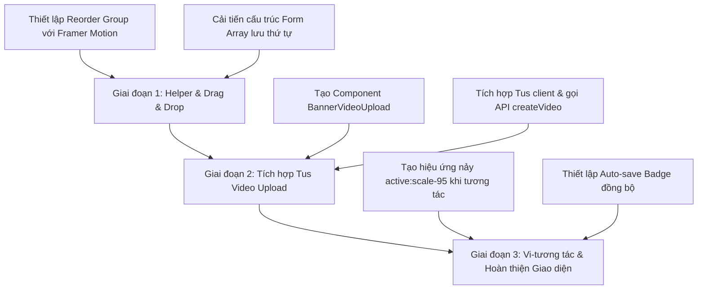

# Spec: Tối Ưu Hóa Giao Diện Nhập Liệu, Kéo Thả & Upload Video Bunny Sản Phẩm Admin

**Trạng thái:** Ready for Implementation  
**Ngày:** 2026-05-21  
**Scope:** Admin Product Management — `AdminProduct/ProductFormPage`  
**Liên quan:** `ProductFormPage/index.tsx`, `BannerSection.tsx`, `useProductForm.ts`, `AdminVideo/VideoPage` (Tus Video upload), `package.json` (framer-motion)

---

## 1. Mô tả bối cảnh & Vấn đề

Trang Form Sản phẩm (`ProductFormPage`) của Admin là cổng quản trị quan trọng để thiết lập thông tin chi tiết của một Tour/Sản phẩm du lịch. Trong đó, **Section đầu tiên (Video sản phẩm & Banner)** đóng vai trò quyết định vì video chất lượng cao là yếu tố then chốt thu hút khách hàng.

### Hiện trạng & Yêu cầu cải tiến:

1. **Media Section (Video/Hình ảnh):**
   - **Hiện trạng:** Người dùng chỉ có thể dán đường dẫn embed tĩnh. Điều này gây khó khăn vì Admin thường có file raw MP4/MOV và muốn upload trực tiếp từ máy của họ.
   - **Giải pháp:** Tích hợp trực tiếp công nghệ **Tus Client Upload** kế thừa từ module [AdminVideo/VideoPage](file:///d:/Remote/web-travel/src/modules/AdminVideo/VideoPage) để tải video trực tiếp lên Bunny Stream, tự động sinh mã nhúng, lưu thông tin vào DB và đồng bộ ngay lập tức vào Form sản phẩm.
   - **Yêu cầu sắp xếp:** Các banner (cả Hình ảnh và Video) cần hỗ trợ **Kéo thả để thay đổi vị trí** (Drag & Drop sorting) trực quan thay vì chỉ hiển thị tĩnh theo thứ tự thêm.

---

## 2. Tiêu chuẩn Premium & Thiết kế Trải nghiệm (WOW UX)

1. **Upload Video trực tiếp (Tus Client Integration):**
   - BannerItem khi chọn loại là **Video** sẽ cung cấp 2 tuỳ chọn: _Dán link embed_ OR _Tải file từ máy_.
   - Khi chọn tải file, tích hợp Dropzone kéo thả file video. Sử dụng `tus-js-client` để upload chunked-upload mượt mà lên Bunny CDN kèm thanh progress bar chuyển động mượt mà.
   - Sau khi upload thành công, hệ thống tự động gọi API `createVideo` để lưu vào DB và trả về `guid` (videoId) và cập nhật đường dẫn `embedUrl` chuẩn vào `banner.[index].url`.
2. **Kéo thả Thay đổi Vị trí (Drag & Drop Reordering):**
   - Tận dụng thư viện **Framer Motion** (`Reorder.Group` và `Reorder.Item`) vốn đã được cài đặt sẵn trong dự án (nhẹ, mượt và an toàn 100% cho React 18 & Next.js).
   - Khi bắt đầu kéo (onDragStart), item con sẽ hơi thu nhỏ nhẹ (`scale: 0.98`), tăng nhẹ đổ bóng (shadow) để tạo cảm giác "nổi lên" dạng 3D (glassmorphism & depth).
   - Các item xung quanh tự động dịch chuyển vị trí cực kỳ mềm mại nhờ thuật toán spring animation của Framer Motion.

---

## 3. Kiến trúc Giải pháp & Code Đặc tả Chi tiết

### 3.1. Drag & Drop Reordering với Framer Motion `Reorder`

Chúng ta sẽ bọc danh sách các `BannerItem` bằng component `<Reorder.Group>` và `<Reorder.Item>` của Framer Motion. Để tương thích hoàn hảo với `useFieldArray` của React Hook Form:

```tsx
import { Reorder, useDragControls } from 'framer-motion';
import { Menu } from 'lucide-react'; // Làm icon handle kéo thả

export function BannerSection() {
  const { control, setValue, watch } = useFormContext<ProductFormValues>();
  const { fields, append, remove, move } = useFieldArray({ control, name: 'banner' });

  // Theo dõi giá trị thực tế của banner array trong form
  const bannerValues = watch('banner') || [];

  const handleReorder = (newOrderedValues: any[]) => {
    // Cập nhật lại toàn bộ mảng banner trong React Hook Form
    setValue('banner', newOrderedValues, { shouldDirty: true });
  };

  return (
    <div className="space-y-5">
      <Reorder.Group axis="y" values={bannerValues} onReorder={handleReorder} className="space-y-4">
        {fields.map((item, index) => {
          // Khớp dữ liệu thực tế từ react-hook-form với fields.id để giữ state kéo thả chuẩn
          const itemValue = bannerValues[index] || item;

          return (
            <Reorder.Item
              key={item.id}
              value={itemValue}
              className="relative p-5 rounded-2xl border border-slate-200 bg-white shadow-sm overflow-hidden select-none"
              whileDrag={{
                scale: 0.99,
                boxShadow: '0 20px 25px -5px rgb(0 0 0 / 0.1), 0 8px 10px -6px rgb(0 0 0 / 0.1)',
                borderColor: 'rgb(99 102 241)', // brand-500
              }}
            >
              {/* Drag Handle Icon */}
              <div className="absolute top-1/2 -translate-y-1/2 left-3 cursor-grab active:cursor-grabbing text-slate-300 hover:text-slate-500 p-1">
                <Menu size={16} />
              </div>

              <div className="pl-6">
                <BannerItem index={index} onRemove={() => remove(index)} />
              </div>
            </Reorder.Item>
          );
        })}
      </Reorder.Group>

      {/* Nút Thêm hình ảnh / Thêm video */}
    </div>
  );
}
```

### 3.2. Tích hợp Tus Client Video Upload (Kế thừa từ `AdminVideo`)

Chúng ta sẽ phát triển một component `BannerVideoUpload` chuyên dụng nhúng trực tiếp trong `BannerItem` khi chọn `type === 'video'`. Component này gọi đúng API `/upload/video` để lấy chữ ký và thực hiện upload Tus trực tiếp lên Bunny Stream:

```tsx
import * as tus from 'tus-js-client';
import { createVideo } from '@/api/video/requests';

function BannerVideoUpload({ value, onChange }: { value: string; onChange: (url: string) => void }) {
  const [uploading, setUploading] = useState(false);
  const [progress, setProgress] = useState(0);
  const fileInputRef = useRef<HTMLInputElement>(null);

  const handleVideoFile = async (e: React.ChangeEvent<HTMLInputElement>) => {
    const file = e.target.files?.[0];
    if (!file) return;

    setUploading(true);
    setProgress(0);

    try {
      // 1. Lấy credentials upload từ API hệ thống
      const credRes = await fetch(`${process.env.NEXT_PUBLIC_API_URL}/upload/video`, {
        method: 'POST',
        headers: { 'Content-Type': 'application/json' },
        body: JSON.stringify({ title: `Product_Video_${Date.now()}` }),
      });

      const { data: credData } = await credRes.json();
      const { videoId: bunnyVideoId, libraryId, expirationTime, signature } = credData;

      // 2. Tiến hành Upload Tus lên Bunny Stream
      const tusUpload = new tus.Upload(file, {
        endpoint: process.env.NEXT_PUBLIC_BUNNY_TUS_ENDPOINT ?? 'https://video.bunnycdn.com/tusupload',
        retryDelays: [0, 3000, 5000],
        headers: {
          AuthorizationSignature: signature,
          AuthorizationExpire: String(expirationTime),
          VideoId: bunnyVideoId,
          LibraryId: libraryId,
        },
        metadata: { filetype: file.type, title: file.name },
        onProgress(bytesUploaded, bytesTotal) {
          const pct = Math.round((bytesUploaded / bytesTotal) * 100);
          setProgress(pct);
        },
        onSuccess: async () => {
          // 3. Upload thành công -> Lưu vào Database với type là 'product_banner'
          try {
            const dbVideo = await createVideo({
              name: file.name.substring(0, 50),
              guid: bunnyVideoId,
              thumbnail: '',
              description: 'Video giới thiệu sản phẩm',
              type: 'product_banner',
              tag: 'product',
            });

            // 4. Sinh URL Embed nhúng vào form
            const embedUrl = `https://player.mediadelivery.net/embed/${libraryId}/${bunnyVideoId}?autoplay=false&loop=true`;
            onChange(embedUrl);
          } catch (err) {
            console.error('Lỗi lưu DB:', err);
          } finally {
            setUploading(false);
          }
        },
        onError(error) {
          console.error('Lỗi upload video:', error);
          setUploading(false);
        },
      });

      tusUpload.start();
    } catch (err) {
      console.error(err);
      setUploading(false);
    }
  };

  return (
    <div className="w-full aspect-video rounded-xl border border-dashed border-slate-300 bg-slate-50 flex flex-col items-center justify-center relative overflow-hidden group">
      {value ? (
        <div className="absolute inset-0">
          <iframe src={value} className="w-full h-full border-0" allowFullScreen />
          <div className="absolute inset-0 bg-black/40 opacity-0 group-hover:opacity-100 flex items-center justify-center transition-opacity">
            <Button
              type="button"
              variant="secondary"
              onClick={() => fileInputRef.current?.click()}
              className="text-xs bg-white text-slate-800"
            >
              Thay đổi Video khác
            </Button>
          </div>
        </div>
      ) : (
        <div className="text-center p-4">
          {uploading ? (
            <div className="space-y-2">
              <Loader2 className="animate-spin text-brand-500 mx-auto" size={24} />
              <p className="text-xs font-semibold text-slate-700">Đang tải lên... {progress}%</p>
              <div className="w-32 h-1 bg-slate-200 rounded-full mx-auto overflow-hidden">
                <div className="h-full bg-brand-500 transition-all duration-300" style={{ width: `${progress}%` }} />
              </div>
            </div>
          ) : (
            <div className="cursor-pointer" onClick={() => fileInputRef.current?.click()}>
              <Video className="mx-auto text-slate-300 group-hover:text-brand-500 transition-colors mb-2" size={28} />
              <p className="text-xs font-semibold text-slate-600 group-hover:text-brand-600">
                Nhấp để tải lên Video sản phẩm
              </p>
              <p className="text-[10px] text-slate-400 mt-1">Hỗ trợ MP4, MOV tối đa 100MB</p>
            </div>
          )}
        </div>
      )}
      <input
        ref={fileInputRef}
        type="file"
        accept="video/*"
        className="hidden"
        onChange={handleVideoFile}
        disabled={uploading}
      />
    </div>
  );
}
```

---

## 4. Kế Hoạch Chiến Lược Lập Trình & Từng Bước Triển Khai

Để đảm bảo an toàn tuyệt đối cho codebase hiện tại mà vẫn mang lại hiệu quả WOW cao nhất, chúng ta sẽ thực hiện theo 3 giai đoạn chiến lược:



### 📅 Giai đoạn 1: Tích hợp Kéo thả Drag & Drop (Day 1)

- **Mục tiêu:** Cài đặt cơ chế kéo thả mượt mà bằng Framer Motion `Reorder` cho `BannerSection`, đồng bộ thứ tự trực tiếp vào React Hook Form.
- **File ảnh hưởng:** `src/modules/AdminProduct/ProductFormPage/components/sections/banner-section.tsx`.

### 📅 Giai đoạn 2: Tải video trực tiếp Bunny Stream (Day 2)

- **Mục tiêu:** Xây dựng component `BannerVideoUpload` sử dụng Tus client upload tương thích 100% với cấu hình API Bunny Stream kế thừa từ AdminVideo.
- **File ảnh hưởng:** `banner-section.tsx` (tích hợp component upload mới), bổ sung helper xử lý upload nếu cần.

### 📅 Giai đoạn 3: Vi-tương tác & Auto-save Indicator (Day 3)

- **Mục tiêu:** Hoàn thiện vi-tương tác, đổ bóng 3D glassmorphism mượt mà khi di chuyển item, đồng bộ trạng thái lưu nháp thời gian thực.
- **File ảnh hưởng:** `ProductFormPage/index.tsx`, `FormActionButtons.tsx`.

---

## 5. Kế hoạch Kiểm thử & Đánh giá (Verification)

- [ ] **Kiểm thử kéo thả:** Kéo thả item 1 xuống dưới item 2, kiểm tra xem dữ liệu submit của form có tự động cập nhật đúng thứ tự mới hay không.
- [ ] **Kiểm thử upload video:** Chọn 1 file MP4 từ máy, upload lên → Kiểm tra progress bar chạy mượt mà từ 0-100% → Đợi video upload thành công và sinh iframe preview chính xác.
- [ ] **Kiểm thử database:** Đảm bảo khi lưu tour, API nhận diện được đúng video vừa tạo và lưu chính xác `guid` trong bảng sản phẩm.

---

## 6. Quy chuẩn Hệ thống & Các Quyết định Kỹ thuật Thống nhất

Để đảm bảo quá trình triển khai thực tế không xảy ra lỗi biên dịch (TypeScript compile errors) hay bất tương thích dữ liệu, các quyết định sau đây đã được thống nhất:

### 6.1. Tương thích Design Token của Button

- **Vấn đề:** Component `Button` chung của hệ thống (`src/components/ui/button.tsx`) không hỗ trợ kích thước `size="sm"`.
- **Giải pháp:** Tất cả các nút tương tác nhỏ (như Tạm dừng, Tiếp tục, Hủy) trong trình tải video của Banner sẽ sử dụng **`size="xs"`** (chiều cao cố định `2rem` ~ `32px`), kết hợp thuộc tính bo góc `rounded="md"` để tạo sự gọn gàng và tương thích 100% với định nghĩa Typescript của dự án.

### 6.2. Cấu hình Dữ liệu Video trong Database

Khi tải video lên Bunny CDN thành công, bản ghi lưu trữ vào DB qua API `createVideo` sẽ tuân thủ cấu hình:

- `type`: `'normal'` (Phân biệt với loại `'hero'` của video trang chủ).
- `tag`: `'product_banner'` (Gắn nhãn định danh video dùng làm banner sản phẩm).
- `description`: `'Video banner sản phẩm'` (Mô tả chuẩn mực cho nội dung).

### 6.3. Giới hạn Kỹ thuật khi Tải file (Client-side Validation)

- **Dung lượng tối đa:** Cho phép tệp tin video tải lên tối đa **100MB**. Các tệp tin lớn hơn sẽ bị từ chối ngay từ giao diện kèm thông báo lỗi trực quan.
- **Định dạng được hỗ trợ:** Chỉ chấp nhận các định dạng video chuẩn mã hóa web thông dụng (`video/*`), khuyên dùng `.mp4` hoặc `.mov`.

### 6.4. Cấu hình Trình phát Video (Embed Query Parameters)

- Link mã nhúng Bunny CDN sinh ra sẽ có cấu hình chuẩn để tối ưu hóa hiệu năng và trải nghiệm người dùng:
- Đường dẫn mẫu: `https://player.mediadelivery.net/embed/{libraryId}/{bunnyVideoId}?autoplay=false&loop=true`
- **`autoplay=false`**: Tránh việc nhiều video cùng tự động phát gây ồn và làm chậm trình duyệt của khách hàng.
- **`loop=true`**: Cho phép video tự động lặp lại liên tục để duy trì trải nghiệm visual sống động cho banner.

### 6.5. Quy chuẩn Thiết kế của Nút "Thêm hình ảnh" & "Thêm video"

Để tạo sự đồng bộ và tăng tính trực quan cho giao diện quản trị, hai nút thêm dữ liệu ở phía cuối BannerSection sẽ được tinh chỉnh thiết kế dựa trên hình ảnh tham chiếu (Button chuẩn của hệ thống trong `src/components/ui/button`):

1.  **Nút "Thêm hình ảnh" (Style 1 - Dạng viền nhạt):**

    - **Mô tả:** Tương ứng với nút _Export_ trong ảnh mẫu, sử dụng nền trắng phẳng, viền xám nhạt, chữ và icon màu xám đậm tối giản.
    - **Cú pháp Component:**
      ```tsx
      <Button
        type="button"
        variant="secondary"
        size="md"
        rounded="md"
        onClick={() => append({ type: 'image', url: '' })}
        className="gap-2 h-10 px-4 bg-white border border-slate-200 text-slate-700 hover:bg-slate-50 hover:text-slate-900 shadow-theme-xs transition-colors rounded-lg font-medium"
      >
        <ImageIcon size={16} className="text-slate-400" />
        Thêm hình ảnh
      </Button>
      ```

2.  **Nút "Thêm video" (Style 2 - Dạng màu thương hiệu Solid):**
    - **Mô tả:** Tương ứng với nút _+ Add Product_ trong ảnh mẫu, sử dụng nền màu xanh thương hiệu (`brand-500` hoặc `#465fff`), chữ và icon màu trắng nổi bật, tạo điểm nhấn hành động chính.
    - **Cú pháp Component:**
      ```tsx
      <Button
        type="button"
        variant="primary"
        size="md"
        rounded="md"
        onClick={() => append({ type: 'video', url: '' })}
        className="gap-2 h-10 px-4 bg-brand-500 hover:bg-brand-600 text-white font-semibold shadow-theme-xs transition-colors rounded-lg border-none"
      >
        <Video size={16} className="text-white" />
        Thêm video
      </Button>
      ```

Cả hai component trên đều sử dụng cấu trúc `Button` chính thức từ `@/components/ui/button`, đảm bảo các hiệu ứng `hover`, `active:scale-95` thống nhất và không bị lệch khỏi hệ thống design system.

### 6.6. Định dạng Cấu trúc Dữ liệu Banner khi Lưu Sản phẩm (Payload API)

Để đảm bảo khả năng tương thích 100% với RESTful API phía Backend, khi người dùng thực hiện hành động Lưu sản phẩm (Submit Form), mảng dữ liệu `banner` gửi đi trong Payload API bắt buộc phải tuân thủ định dạng tối giản, loại bỏ các thuộc tính định danh tạm thời của phía Client (như trường `id` tự sinh bởi `useFieldArray`) và giữ lại chính xác hai thuộc tính cốt lõi:

- **`type`**: Kiểu dữ liệu hiển thị, nhận một trong hai giá trị duy nhất: `"image"` hoặc `"video"`.
- **`url`**: Đường dẫn trực tiếp của hình ảnh hoặc đường dẫn mã nhúng (embed) của video Bunny CDN.

**Ví dụ định dạng JSON Payload gửi lên Server:**

```json
{
  "banner": [
    {
      "type": "image",
      "url": "https://example.com/banner.jpg"
    },
    {
      "type": "video",
      "url": "https://example.com/banner.mp4"
    }
  ]
}
```

Việc lọc sạch các trường dữ liệu tạm thời này sẽ được thực hiện trước khi submit hoặc tự động xử lý khi submit form:

```tsx
const cleanValues = bannerValues.map((item) => ({
  type: item.type,
  url: item.url,
}));
```
