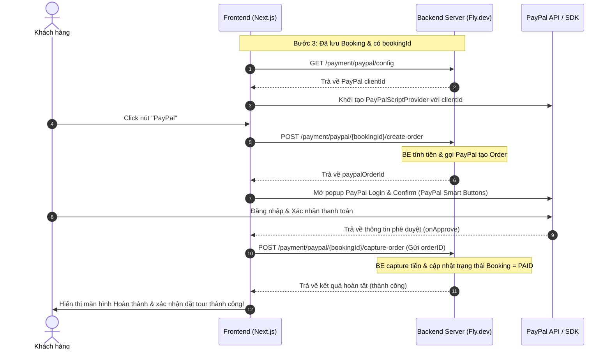

# Đặc Tả Kỹ Thuật: Tích hợp Thanh toán PayPal vào Luồng Đặt Tour

Tài liệu này đặc tả chi tiết quy trình tích hợp cổng thanh toán **PayPal** vào Bước 4 (Payment) của module **Booking Sheet** (`src/modules/ProductPage/components/booking-sheet`) sử dụng thư viện `@paypal/react-paypal-js`.

---

## 1. Luồng hoạt động Thanh toán (Sequence Diagram)

Quy trình thanh toán giữa Frontend, Backend và PayPal SDK được mô tả qua sơ đồ sau:



---

## 2. Các API Contract của PayPal từ Backend

### 2.1. Lấy Config PayPal Client ID

- **URL**: `https://web-travel-be.fly.dev/payment/paypal/config`
- **Method**: `GET`
- **Headers**: `accept: application/json`
- **Response Payload**:

```json
{
  "data": {
    "clientId": "AWrRmS0Slqe7Xqm9le6CfwEW5lb_HM3VnGsGOknFywL9UCqtwkwLgUo0jTYJYq1HDjTqyJnPeklvgFkg",
    "currency": "USD"
  },
  "code": 200,
  "message": "paypal config",
  "error": null
}
```

### 2.2. Tạo PayPal Order cho Booking

- **URL**: `https://web-travel-be.fly.dev/payment/paypal/{bookingId}/create-order`
- **Method**: `POST`
- **Path Parameter**: `bookingId` (UUID của Booking được tạo ở Step 3)
- **Response Payload**:

```json
{
  "data": {
    "orderId": "5O19847113174245L (Mã ID Order của hệ thống PayPal)"
  },
  "code": 200,
  "message": "ok",
  "error": null
}
```

### 2.3. Capture PayPal Order để nhận tiền

- **URL**: `https://web-travel-be.fly.dev/payment/paypal/{bookingId}/capture-order`
- **Method**: `POST`
- **Path Parameter**: `bookingId` (UUID)
- **Request Body**:

```json
{
  "orderId": "5O19847113174245L"
}
```

- **Response Payload**:

```json
{
  "data": {
    "status": "COMPLETED",
    "paymentId": "PAYID-M456789...",
    "updatedBooking": {
      "id": "booking-uuid",
      "status": "paid"
    }
  },
  "code": 200,
  "message": "ok",
  "error": null
}
```

---

## 3. Quy trình Triển khai Frontend

### Bước 1: Cài đặt thư viện PayPal SDK

Cài đặt thư viện chính thức của PayPal cho React/Next.js:

```bash
pnpm add @paypal/react-paypal-js
```

---

### Bước 2: Tạo module API Payment (`src/api/payment`)

Khởi tạo thư mục mới `src/api/payment` quản lý các kiểu dữ liệu và query/mutation của thanh toán:

#### [NEW] [src/api/payment/types.ts](file:///d:/Remote/web-travel/src/api/payment/types.ts)

```typescript
export interface ApiPaypalConfig {
  clientId: string;
  currency: string;
}

export interface ApiPaypalConfigResponse {
  data: ApiPaypalConfig;
  code: number;
  message: string;
  error: string | null;
}

export interface ApiPaypalCreateOrderResponse {
  data: {
    orderId: string;
  };
  code: number;
  message: string;
}

export interface ApiPaypalCaptureOrderResponse {
  data: {
    status: 'COMPLETED' | 'FAILED';
    paymentId: string;
  };
  code: number;
  message: string;
}
```

#### [NEW] [src/api/payment/requests.ts](file:///d:/Remote/web-travel/src/api/payment/requests.ts)

```typescript
import { request } from '../axios';
import type {
  ApiPaypalConfig,
  ApiPaypalConfigResponse,
  ApiPaypalCreateOrderResponse,
  ApiPaypalCaptureOrderResponse,
} from './types';

export async function getPaypalConfig(): Promise<ApiPaypalConfig> {
  const { data } = await request.get<ApiPaypalConfigResponse>('/payment/paypal/config');
  return data.data;
}

export async function createPaypalOrder(bookingId: string): Promise<string> {
  const { data } = await request.post<ApiPaypalCreateOrderResponse>(`/payment/paypal/${bookingId}/create-order`);
  return data.data.orderId;
}

export async function capturePaypalOrder(
  bookingId: string,
  orderId: string
): Promise<ApiPaypalCaptureOrderResponse['data']> {
  const { data } = await request.post<ApiPaypalCaptureOrderResponse>(`/payment/paypal/${bookingId}/capture-order`, {
    orderId,
  });
  return data.data;
}
```

#### [NEW] [src/api/payment/queries.ts](file:///d:/Remote/web-travel/src/api/payment/queries.ts)

```typescript
import { createMutation, createQuery } from 'react-query-kit';
import { getPaypalConfig, createPaypalOrder, capturePaypalOrder } from './requests';
import type { ApiPaypalConfig, ApiPaypalCaptureOrderResponse } from './types';

export const usePaypalConfig = createQuery<ApiPaypalConfig>({
  primaryKey: '/payment/paypal/config',
  queryFn: () => getPaypalConfig(),
});

export const useCreatePaypalOrder = createMutation<string, { bookingId: string }>({
  mutationFn: ({ bookingId }) => createPaypalOrder(bookingId),
});

export const useCapturePaypalOrder = createMutation<
  ApiPaypalCaptureOrderResponse['data'],
  { bookingId: string; orderId: string }
>({
  mutationFn: ({ bookingId, orderId }) => capturePaypalOrder(bookingId, orderId),
});
```

#### [NEW] [src/api/payment/index.ts](file:///d:/Remote/web-travel/src/api/payment/index.ts)

```typescript
export * from './queries';
export * from './types';
```

---

### Bước 3: Cập nhật Zustand Store để lưu giữ ID của Booking

#### [MODIFY] [src/stores/BookingStore.ts](file:///d:/Remote/web-travel/src/stores/BookingStore.ts)

Cần lưu `bookingId` sau khi gọi API tạo booking thành công ở Bước 3 để sử dụng ở Bước 4:

```typescript
interface BookingState {
  // ... các trường cũ
  bookingId: string | null; // Lưu ID Booking sau khi lưu DB thành công ở Bước 3
}

interface BookingActions {
  // ... các actions cũ
  setBookingId: (id: string | null) => void;
}
```

---

### Bước 4: Cập nhật luồng chuyển bước tại `useBookingSheetState`

#### [MODIFY] [src/modules/ProductPage/components/booking-sheet/use-booking-sheet-state.ts]

Cập nhật sự kiện `onSuccess` khi tạo booking để lưu `bookingId` vào store:

```typescript
const setBookingId = useBookingStore.use.setBookingId();

// ... bên trong handleNext khi tạo booking thành công:
callCreateBooking(payload, {
  onSuccess: (data) => {
    setBookingId(data.id); // Lưu bookingId vào store
    setStep(4);
  },
  onError: (err: any) => {
    toast.error(err?.message || 'Có lỗi xảy ra khi tạo đơn đặt tour.');
  },
});
```

---

### Bước 5: Cập nhật Giao diện Thanh toán `StepPayment`

#### [MODIFY] [src/modules/ProductPage/components/booking-sheet/step-payment.tsx]

Thay đổi nút PayPal tĩnh thành nút PayPal SDK động sử dụng `@paypal/react-paypal-js` và các hook mutation:

```tsx
import React from 'react';
import { PayPalScriptProvider, PayPalButtons } from '@paypal/react-paypal-js';
import { useTranslation } from 'next-i18next';
import { toast } from 'react-hot-toast';
import { motion } from 'framer-motion';

import { useBookingStore } from '@/stores/BookingStore';
import { usePaypalConfig, useCreatePaypalOrder, useCapturePaypalOrder } from '@/api/payment';

interface StepPaymentProps {
  productName: string;
  duration: string;
  total: number;
  currency: string;
  onEditBooking: () => void;
}

export default function StepPayment({ productName, total, currency, onEditBooking }: StepPaymentProps) {
  const { t } = useTranslation('productPage');
  const bookingId = useBookingStore.use.bookingId();
  const resetBookingStore = useBookingStore.use.reset();

  const [paymentSuccess, setPaymentSuccess] = React.useState(false);

  // Load config client ID của PayPal từ Backend
  const { data: paypalConfig, isLoading: isLoadingConfig } = usePaypalConfig({
    enabled: !!bookingId,
  });

  const { mutateAsync: callCreateOrder } = useCreatePaypalOrder();
  const { mutateAsync: callCaptureOrder, isLoading: isCapturing } = useCapturePaypalOrder();

  const handleCreateOrder = async () => {
    if (!bookingId) {
      toast.error('Không tìm thấy mã đặt chỗ.');
      throw new Error('Missing bookingId');
    }
    try {
      // Gọi API Backend để tạo order trên PayPal và lấy Order ID
      const orderId = await callCreateOrder({ bookingId });
      return orderId;
    } catch (err: any) {
      toast.error('Không thể tạo giao dịch với PayPal.');
      throw err;
    }
  };

  const handleApprove = async (data: { orderID: string }) => {
    if (!bookingId) return;
    try {
      // Gọi API Backend capture tiền để hoàn tất thanh toán
      const captureResult = await callCaptureOrder({ bookingId, orderId: data.orderID });
      if (captureResult.status === 'COMPLETED') {
        toast.success('Thanh toán thành công!');
        setPaymentSuccess(true);
        // Có thể dọn dẹp store sau khi thanh toán thành công
        // resetBookingStore();
      } else {
        toast.error('Giao dịch chưa được hoàn tất.');
      }
    } catch (err: any) {
      toast.error('Có lỗi xảy ra trong quá trình xác nhận thanh toán.');
    }
  };

  if (paymentSuccess) {
    return (
      <div className="flex flex-col items-center justify-center py-16 px-5 text-center gap-4">
        <div className="w-20 h-20 rounded-full bg-[#EAF7F1] flex items-center justify-center text-[44px]">✅</div>
        <h2 className="text-[22px] font-bold text-[#111]">Thanh Toán Thành Công!</h2>
        <p className="text-[14px] text-[#666] leading-relaxed">
          Đơn đặt tour **{productName}** của bạn đã được xác nhận thanh toán hoàn tất. Chúng tôi đã gửi email thông tin
          chi tiết hóa đơn tới bạn.
        </p>
        <button
          onClick={() => window.location.replace('/')}
          className="mt-6 px-8 py-3 bg-[#0F6E56] text-white rounded-full text-[14px] font-semibold"
        >
          Quay lại Trang Chủ
        </button>
      </div>
    );
  }

  return (
    <div className="flex flex-col gap-5 px-5 pt-5 pb-8">
      {/* Celebration Header */}
      <div className="flex flex-col items-center text-center pt-4 pb-2 gap-2">
        <div className="w-16 h-16 rounded-full bg-[#EAF7F1] flex items-center justify-center text-[36px]">🎉</div>
        <p className="text-[22px] font-bold text-[#111] mt-1">Gần như hoàn tất!</p>
        <p className="text-[14px] text-[#777]">Hóa đơn của bạn đã sẵn sàng — vui lòng thanh toán để hoàn tất</p>
      </div>

      {/* Order Summary ... (giữ nguyên UI hiển thị thông tin hóa đơn) */}

      <div className="flex flex-col gap-3 mt-4">
        {/* Nút thanh toán bằng thẻ tín dụng thông thường (Credit Card - Tùy chọn) */}
        <button className="w-full rounded-[16px] bg-[#5B5FE8] flex items-center justify-between px-5 py-[18px] shadow-sm text-white">
          <div className="flex items-center gap-4">
            <span className="text-[20px]">💳</span>
            <div className="text-left">
              <p className="text-[15px] font-bold leading-none">Thanh toán bằng Thẻ</p>
              <p className="text-[12px] text-white/70 mt-1">Visa, Mastercard, Amex</p>
            </div>
          </div>
          <span>→</span>
        </button>

        {/* Nút PayPal Smart Button tích hợp */}
        {isLoadingConfig || !paypalConfig?.clientId ? (
          <div className="w-full h-[55px] rounded-[16px] bg-[#F4F4F4] animate-pulse flex items-center justify-center text-[13px] text-[#888] font-medium">
            Đang tải cổng thanh toán PayPal...
          </div>
        ) : (
          <div className="relative z-10 w-full">
            {isCapturing && (
              <div className="absolute inset-0 bg-white/70 z-20 flex items-center justify-center rounded-[16px]">
                <div className="animate-spin rounded-full h-6 w-6 border-b-2 border-[#0F6E56]" />
                <span className="text-[13px] text-[#0F6E56] font-semibold ml-2">Đang xác nhận...</span>
              </div>
            )}
            <StepPaymentPaypalButton
              clientId={paypalConfig.clientId}
              currency={paypalConfig.currency}
              isCapturing={isCapturing}
              onCreateOrder={handleCreateOrder}
              onApprove={handleApprove}
              onError={() => {
                toast.error('Lỗi cổng thanh toán PayPal.');
              }}
              onCancel={() => {
                toast.info('Giao dịch thanh toán đã bị hủy.');
              }}
            />
          </div>
        )}
      </div>

      {/* Edit link quay lại */}
      {!isCapturing && (
        <button onClick={onEditBooking} className="w-full text-center text-[13px] text-[#0F6E56] font-medium mt-4">
          ← Sửa thông tin đơn đặt tour
        </button>
      )}
    </div>
  );
}
```

#### [NEW] [step-payment-paypal-button.tsx](file:///d:/Remote/web-travel/src/modules/ProductPage/components/booking-sheet/step-payment-paypal-button.tsx)

```tsx
import { PayPalButtons, PayPalScriptProvider } from '@paypal/react-paypal-js';
import { useTranslation } from 'next-i18next';

interface StepPaymentPaypalButtonProps {
  clientId: string;
  currency: string;
  isCapturing: boolean;
  onCreateOrder: () => Promise<string>;
  onApprove: (data: { orderID: string }) => Promise<void>;
  onError: () => void;
  onCancel: () => void;
}

export function StepPaymentPaypalButton({
  clientId,
  currency,
  isCapturing,
  onCreateOrder,
  onApprove,
  onError,
  onCancel,
}: StepPaymentPaypalButtonProps) {
  const { t } = useTranslation('productPage');

  return (
    <div className="relative z-10 w-full">
      {isCapturing && (
        <div className="absolute inset-0 bg-white/80 z-30 flex items-center justify-center gap-2 rounded-[16px]">
          <div className="animate-spin rounded-full h-5 w-5 border-b-2 border-[#0F6E56]" />
          <span className="text-[13px] text-[#0F6E56] font-semibold">{t('booking.paymentConfirming')}</span>
        </div>
      )}

      {/* 1. Giao diện nút PayPal custom theo thiết kế */}
      <div className="w-full rounded-[16px] bg-[#FFC439] flex items-center justify-between px-5 py-[18px] shadow-sm select-none pointer-events-none">
        <div className="flex items-center gap-4">
          <div className="w-10 h-10 rounded-[10px] bg-[#E2A621] flex items-center justify-center flex-shrink-0">
            <span className="text-[14px] font-black text-[#1C2B5E] tracking-tight leading-none">PP</span>
          </div>
          <div>
            <p className="text-[15px] font-bold text-[#1C2B5E] leading-snug">PayPal</p>
            <p className="text-[13px] text-[#1C2B5E]/70 mt-0.5">Fast &amp; secure checkout</p>
          </div>
        </div>
        <span className="text-[#1C2B5E]/60 text-[18px] flex-shrink-0 ml-2">→</span>
      </div>

      {/* 2. PayPal Smart Buttons thực tế được ẩn đi (opacity-0) đè lên trên để nhận sự kiện Click */}
      <div className="absolute inset-0 opacity-0 z-20 overflow-hidden rounded-[16px] [&_*]:h-full [&_*]:min-h-full">
        <PayPalScriptProvider
          options={{
            'client-id': clientId,
            currency,
            intent: 'capture',
            'disable-funding': 'card,credit,paylater',
          }}
        >
          <PayPalButtons
            style={{
              layout: 'vertical',
              shape: 'rect',
              label: 'pay',
              height: 52,
            }}
            createOrder={onCreateOrder}
            onApprove={onApprove}
            onError={onError}
            onCancel={onCancel}
          />
        </PayPalScriptProvider>
      </div>
    </div>
  );
}
```
