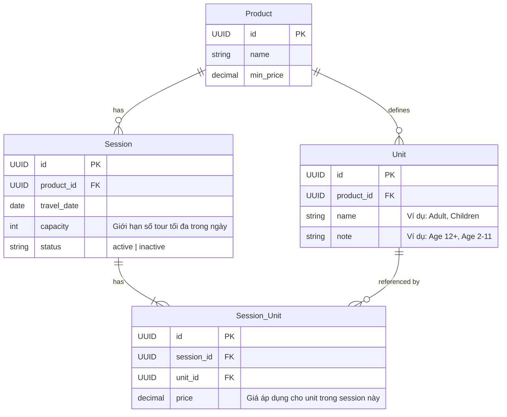

# Đặc tả Kỹ thuật: Cập nhật API Session cho Booking Sheet

Tài liệu này mô tả chi tiết yêu cầu tích hợp API `/session` mới thay thế cho API `/tour-session` cũ trong module **Booking Sheet** (`src/modules/ProductPage/components/booking-sheet`).

---

## 1. Tổng quan Quan hệ Thực thể & Database

Cấu trúc mới chuyển từ mô hình **Tour Session** sang **Session** linh hoạt hơn. Một `Product` có nhiều `Session` đại diện cho các ngày khởi hành cụ thể, và mỗi `Session` có thể chứa nhiều `SessionUnit` (ví dụ: Vé Người lớn, Vé Trẻ em) được định nghĩa giá riêng từ bảng `Unit`.



---

## 2. API Contracts Mới

### 2.1. API Session: `GET /session` (Dùng cho Bước 1)

- **Mục đích**: Lấy thông tin giá vé thực tế theo ngày đi cho từng loại đối tượng khách (Người lớn, Trẻ em) và giới hạn đặt vé tối đa của ngày đó.
- **URL**: `https://web-travel-be.fly.dev/session`
- **Method**: `GET`
- **Query Parameters**:
  - `productId` (UUID, required): ID của sản phẩm/tour.
  - `fromDate` (string YYYY-MM-DD, required): Ngày đi cần tìm kiếm.
  - `toDate` (string YYYY-MM-DD, required): Ngày đi cần tìm kiếm.
  - `page` & `pageSize` (optional)

_Ví dụ phản hồi thực tế từ API:_

```json
{
  "data": {
    "items": [
      {
        "id": "7dde85e5-1e02-49bd-b5c1-ac7883ec002c",
        "createdAt": "2026-07-22T11:10:16.267Z",
        "updatedAt": "2026-07-22T11:10:16.267Z",
        "deletedAt": null,
        "productId": "26880442-15a9-4725-82b2-fc530d3f0e62",
        "travelDate": "2026-07-30T11:10:16.267Z",
        "capacity": 20,
        "status": "active",
        "sessionUnits": [
          {
            "id": "3496f0c7-99a3-4e7f-882c-7c1407ba0f23",
            "createdAt": "2026-07-31T14:10:35.416Z",
            "updatedAt": "2026-07-31T14:10:35.416Z",
            "deletedAt": null,
            "sessionId": "7dde85e5-1e02-49bd-b5c1-ac7883ec002c",
            "unitId": "34cdbd35-7bf1-4cbe-a424-596725f79ca1",
            "price": "100.00",
            "unit": {
              "id": "34cdbd35-7bf1-4cbe-a424-596725f79ca1",
              "createdAt": "2026-07-31T14:09:23.170Z",
              "updatedAt": "2026-07-31T14:09:23.170Z",
              "deletedAt": null,
              "productId": "26880442-15a9-4725-82b2-fc530d3f0e62",
              "name": "Adult",
              "note": "Age 12+"
            }
          },
          {
            "id": "937e2761-6a82-4e9b-93ec-f7f005ec5a81",
            "createdAt": "2026-07-31T14:11:27.513Z",
            "updatedAt": "2026-07-31T14:11:27.513Z",
            "deletedAt": null,
            "sessionId": "7dde85e5-1e02-49bd-b5c1-ac7883ec002c",
            "unitId": "95662a1c-0c42-484a-9b91-47eb94b60a5b",
            "price": "50.00",
            "unit": {
              "id": "95662a1c-0c42-484a-9b91-47eb94b60a5b",
              "createdAt": "2026-07-31T14:09:23.170Z",
              "updatedAt": "2026-07-31T14:09:23.170Z",
              "deletedAt": null,
              "productId": "26880442-15a9-4725-82b2-fc530d3f0e62",
              "name": "Children",
              "note": "Age 2–11"
            }
          }
        ]
      }
    ],
    "pagination": {
      "page": 1,
      "pageSize": 10,
      "total": 1,
      "totalPages": 1
    }
  },
  "code": 200,
  "message": "ok",
  "error": null
}
```

---

### 2.2. API Booking Config: `GET /product/:productId/booking` (Dùng cho Bước 2)

- **Mục đích**: Thay thế cho API `/option/:id` cũ. Lấy cấu hình đặt chỗ liên quan đến một Sản phẩm (không phụ thuộc vào option cố định) bao gồm: danh sách giờ xuất phát, danh sách điểm đón, và danh sách các gói option (packages).
- **URL**: `https://web-travel-be.fly.dev/product/:productId/booking`
- **Method**: `GET`
- **Headers**: `accept: application/json`

_Ví dụ phản hồi thực tế từ API:_

```json
{
  "data": {
    "departureTimes": [
      {
        "id": "9cb1d1e3-4e3c-4a4a-ad0a-401c3c340363",
        "createdAt": "2026-07-23T09:23:24.806Z",
        "updatedAt": "2026-07-23T09:23:24.806Z",
        "deletedAt": null,
        "productId": "26880442-15a9-4725-82b2-fc530d3f0e62",
        "time": "07:00:00",
        "label": "Morning departure",
        "order": 1,
        "isActive": true,
        "note": null
      },
      {
        "id": "99f50c24-9fda-4363-9a70-dd11a5b6b0b6",
        "createdAt": "2026-07-23T09:23:24.806Z",
        "updatedAt": "2026-07-23T09:23:24.806Z",
        "deletedAt": null,
        "productId": "26880442-15a9-4725-82b2-fc530d3f0e62",
        "time": "13:00:00",
        "label": "Afternoon departure",
        "order": 2,
        "isActive": true,
        "note": null
      }
    ],
    "pickupLocations": [
      {
        "id": "064e3ab3-c200-4bd3-8f0a-17f3cc29879f",
        "createdAt": "2026-07-23T09:20:44.670Z",
        "updatedAt": "2026-07-23T09:20:44.670Z",
        "deletedAt": null,
        "productId": "26880442-15a9-4725-82b2-fc530d3f0e62",
        "name": "Hoan Kiem Lake",
        "address": null,
        "isPopular": true,
        "mapUrl": null,
        "order": 1
      },
      {
        "id": "747c0617-0668-4592-8e04-60d940df66f1",
        "createdAt": "2026-07-23T09:20:44.670Z",
        "updatedAt": "2026-07-23T09:20:44.670Z",
        "deletedAt": null,
        "productId": "26880442-15a9-4725-82b2-fc530d3f0e62",
        "name": "HaNoi Old Quarter",
        "address": null,
        "isPopular": false,
        "mapUrl": null,
        "order": 2
      }
    ],
    "options": [
      {
        "id": "6a9ff6ac-d5cb-4e1d-aae0-4df60f70ddaf",
        "createdAt": "2026-07-22T03:58:03.647Z",
        "updatedAt": "2026-07-22T03:58:03.647Z",
        "deletedAt": null,
        "title": "Tour du lịch miền bắc",
        "description": null,
        "day": 2,
        "night": 1,
        "isDefault": true,
        "status": "active",
        "order": 1,
        "allowUnit": null,
        "currency": "USD",
        "productId": "26880442-15a9-4725-82b2-fc530d3f0e62"
      },
      {
        "id": "e648afc1-a9ad-4ee5-a3e0-e363963bcb87",
        "createdAt": "2026-07-23T00:40:02.102Z",
        "updatedAt": "2026-07-23T00:40:02.102Z",
        "deletedAt": null,
        "title": "Standard Tour Option",
        "description": null,
        "day": 2,
        "night": 1,
        "isDefault": false,
        "status": "active",
        "order": 2,
        "allowUnit": null,
        "currency": "USD",
        "productId": "26880442-15a9-4725-82b2-fc530d3f0e62"
      }
    ]
  },
  "code": 200,
  "message": "ok",
  "error": null
}
```

> [!IMPORTANT]
>
> - Các thực thể `departureTimes` và `pickupLocations` bây giờ liên kết trực tiếp với sản phẩm bằng trường `productId` (thay vì `optionId` trước đây).
> - Số lượng chỗ trống ("spots left") trong các khung giờ xuất phát tại Bước 2 **không cần hiển thị nữa** (được coi là không giới hạn - `unlimited`).
> - Gói tùy chọn (Tour Options/Packages) ở Bước 2 sẽ hiển thị động dựa trên danh sách `options` trả về từ API này chứ không dùng mảng hardcode `basic` / `premium` nữa.

---

## 3. Quy trình Tích hợp Frontend

### Bước 1: Khởi tạo module API Session (`src/api/session`)

Tạo thư mục mới `src/api/session` chứa các định nghĩa kiểu dữ liệu và query hook:

#### [NEW] [src/api/session/types.ts](file:///d:/Remote/web-travel/src/api/session/types.ts)

```typescript
export interface ApiUnit {
  id: string;
  createdAt: string;
  updatedAt: string;
  deletedAt: string | null;
  productId: string;
  name: string;
  note: string | null;
}

export interface ApiSessionUnit {
  id: string;
  createdAt: string;
  updatedAt: string;
  deletedAt: string | null;
  sessionId: string;
  unitId: string;
  price: string;
  unit?: ApiUnit;
}

export interface ApiSessionItem {
  id: string;
  createdAt: string;
  updatedAt: string;
  deletedAt: string | null;
  productId: string;
  travelDate: string;
  capacity: number;
  status: 'active' | 'inactive';
  sessionUnits: ApiSessionUnit[];
}

export interface ISessionParams {
  productId: string;
  fromDate: string;
  toDate: string;
  page?: number;
  pageSize?: number;
  keyword?: string;
}

export interface ApiSessionData {
  items: ApiSessionItem[];
  pagination: {
    page: number;
    pageSize: number;
    total: number;
    totalPages: number;
  };
}

export interface ApiSessionResponse {
  data: ApiSessionData;
  code: number;
  message: string;
  error: string | null;
}
```

#### [NEW] [src/api/session/requests.ts](file:///d:/Remote/web-travel/src/api/session/requests.ts)

```typescript
import { request } from '../axios';
import type { ApiSessionData, ApiSessionResponse, ISessionParams } from './types';

export async function getSessions(params: ISessionParams): Promise<ApiSessionData> {
  const { data } = await request.get<ApiSessionResponse>('/session', { params });
  return data.data;
}
```

#### [NEW] [src/api/session/queries.ts](file:///d:/Remote/web-travel/src/api/session/queries.ts)

```typescript
import { createQuery } from 'react-query-kit';
import { getSessions } from './requests';
import type { ApiSessionData, ISessionParams } from './types';

export const useSessions = createQuery<ApiSessionData, ISessionParams>({
  primaryKey: '/session',
  queryFn: ({ queryKey: [, variables] }) => getSessions(variables),
});
```

#### [NEW] [src/api/session/index.ts](file:///d:/Remote/web-travel/src/api/session/index.ts)

```typescript
export * from './queries';
export * from './types';
```

---

### Bước 2: Bổ sung API Product Booking Config (`src/api/product`)

#### [MODIFY] [src/api/product/types.ts](file:///d:/Remote/web-travel/src/api/product/types.ts)

Định nghĩa kiểu dữ liệu cho config booking của sản phẩm:

```typescript
export interface ApiProductBookingDepartureTime {
  id: string;
  createdAt: string;
  updatedAt: string;
  deletedAt: string | null;
  productId: string;
  time: string;
  label: string;
  order: number;
  isActive: boolean;
  note: string | null;
}

export interface ApiProductBookingPickupLocation {
  id: string;
  createdAt: string;
  updatedAt: string;
  deletedAt: string | null;
  productId: string;
  name: string;
  address: string | null;
  isPopular: boolean;
  mapUrl: string | null;
  order: number;
}

export interface ApiProductBookingOption {
  id: string;
  createdAt: string;
  updatedAt: string;
  deletedAt: string | null;
  title: string;
  description: string | null;
  day: number;
  night: number;
  isDefault: boolean;
  status: 'active' | 'inactive';
  order: number;
  allowUnit: string | null;
  currency: string;
  productId: string;
}

export interface ApiProductBookingData {
  departureTimes: ApiProductBookingDepartureTime[];
  pickupLocations: ApiProductBookingPickupLocation[];
  options: ApiProductBookingOption[];
}

export interface ApiProductBookingResponse {
  data: ApiProductBookingData;
  code: number;
  message: string;
  error: string | null;
}
```

#### [MODIFY] [src/api/product/requests.ts](file:///d:/Remote/web-travel/src/api/product/requests.ts)

Thêm request function:

```typescript
export async function getProductBookingDetail(productId: string): Promise<ApiProductBookingData> {
  const { data } = await request.get<ApiProductBookingResponse>(`/product/${productId}/booking`);
  return data.data;
}
```

#### [MODIFY] [src/api/product/queries.ts](file:///d:/Remote/web-travel/src/api/product/queries.ts)

Khởi tạo query hook bằng react-query-kit:

```typescript
export const useProductBookingDetail = createQuery<ApiProductBookingData, { id: string }>({
  primaryKey: '/product/booking',
  queryFn: ({ queryKey: [, { id }] }) => getProductBookingDetail(id),
});
```

---

### Bước 3: Cập nhật luồng State và Nhận dữ liệu tại BookingSheet

#### [MODIFY] [src/stores/BookingStore.ts](file:///d:/Remote/web-travel/src/stores/BookingStore.ts)

Cập nhật kiểu `packageType` từ `'basic' | 'premium' | null` thành string động (lưu ID của Option được chọn):

```typescript
interface BookingState {
  // ...
  packageType: string | null; // Lưu Option ID thay vì chuỗi cứng
  // ...
}
```

#### [MODIFY] [src/modules/ProductPage/components/booking-sheet/index.tsx]

Thay thế `useOptionDetail` (cũ) bằng `useProductBookingDetail` (mới) để lấy dữ liệu config cho trang 2.

```typescript
import { useProductBookingDetail } from '@/api/product';

interface BookingSheetProps {
  productId: string;
  productName: string;
  duration: string;
  adultPrice: number;
  currency: string;
  onClose: () => void;
}

export default function BookingSheet({
  productId,
  productName,
  duration,
  adultPrice,
  currency,
  onClose: _onClose,
}: BookingSheetProps) {
  // ...
  // Gọi API mới thay vì useOptionDetail
  const { data: bookingDetail, isLoading: isLoadingBookingDetail } = useProductBookingDetail({
    variables: { id: productId },
    enabled: !!productId,
  });

  const departureTimes = bookingDetail?.departureTimes ?? [];
  const pickupLocations = bookingDetail?.pickupLocations ?? [];
  const options = bookingDetail?.options ?? []; // Danh sách options/packages động

  return (
    // ...
    {step === 1 && <StepInfo productId={productId} adultPrice={adultPrice} currency={currency} />}
    {step === 2 && (
      <StepOptions
        departureTimes={departureTimes}
        pickupLocations={pickupLocations}
        options={options}
        currency={currency}
        isLoading={isLoadingBookingDetail}
      />
    )}
    // ...
  );
}
```

#### [MODIFY] [src/modules/ProductPage/components/booking-sheet/step-options.tsx]

Render danh sách các Tour Options (Packages) và Departure Times theo cấu hình động từ API, loại bỏ "spots left":

```typescript
import type {
  ApiProductBookingDepartureTime,
  ApiProductBookingPickupLocation,
  ApiProductBookingOption,
} from '@/api/product/types';

interface StepOptionsProps {
  departureTimes: ApiProductBookingDepartureTime[];
  pickupLocations: ApiProductBookingPickupLocation[];
  options: ApiProductBookingOption[];
  currency: string;
  isLoading?: boolean;
}

export default function StepOptions({
  departureTimes,
  pickupLocations,
  options,
  currency,
  isLoading,
}: StepOptionsProps) {
  const { t } = useTranslation('productPage');
  const departureTime = useBookingStore.use.departureTime();
  const setDepartureTime = useBookingStore.use.setDepartureTime();
  const packageType = useBookingStore.use.packageType(); // Ở đây packageType lưu trữ Option ID được chọn
  const setPackageType = useBookingStore.use.setPackageType();

  // Tự động chọn Option đầu tiên/Default và giờ đầu tiên làm mặc định
  React.useEffect(() => {
    if (isLoading) return;
    const activeSlots = departureTimes.filter((slot) => slot.isActive);
    if (activeSlots.length > 0 && !departureTime) {
      setDepartureTime(activeSlots[0].id);
    }
    const defaultOpt = options.find((o) => o.isDefault) ?? options[0];
    if (defaultOpt && !packageType) {
      setPackageType(defaultOpt.id);
    }
  }, [departureTimes, departureTime, options, packageType, setDepartureTime, setPackageType, isLoading]);

  if (isLoading) {
    return (
      <div className="flex flex-col items-center justify-center py-20 gap-3">
        <div className="animate-spin rounded-full h-8 w-8 border-b-2 border-[#0F6E56]" />
        <p className="text-[14px] text-[#888] font-medium">{t('booking.loadingOptions')}</p>
      </div>
    );
  }

  const activeSlots = departureTimes.filter((slot) => slot.isActive);

  return (
    <div className="flex flex-col gap-5 px-5 pt-5 pb-8">
      {/* 1. Departure Times (Loại bỏ nhãn Spots Left) */}
      <div>
        <div className="flex items-center gap-1.5 mb-3">
          <span>⏰</span>
          <span className="text-[11px] font-bold text-[#333] uppercase tracking-wider">
            {t('booking.departureTime')}
          </span>
        </div>
        <div className="grid grid-cols-2 gap-3">
          {activeSlots.map((slot) => {
            const active = departureTime === slot.id;
            return (
              <button
                key={slot.id}
                onClick={() => setDepartureTime(slot.id)}
                className={cn(
                  'rounded-[16px] border px-6 py-[22px] text-left transition-all',
                  active
                    ? 'border-[#0F6E56] bg-[#0F6E56] text-white shadow-md'
                    : 'border-[#E5E5E5] bg-white text-[#111] shadow-sm'
                )}
              >
                <p className="text-[26px] font-bold leading-none tracking-tight">{slot.time.slice(0, 5)}</p>
                <p className={cn('text-[12px] mt-1', active ? 'text-[#A8D8C9]' : 'text-[#666]')}>{slot.label}</p>
                {slot.note && (
                  <p className={cn('text-[11px] mt-1', active ? 'text-[#A8D8C9]' : 'text-[#999]')}>{slot.note}</p>
                )}
              </button>
            );
          })}
        </div>
      </div>

      {/* 2. Pickup Location */}
      <div>
        <div className="flex items-center gap-1.5 mb-3">
          <span>📍</span>
          <span className="text-[11px] font-bold text-[#333] uppercase tracking-wider">
            {t('booking.pickupLocation')}
          </span>
        </div>
        <PickupLocationSection pickupLocations={pickupLocations} currency={currency} />
      </div>

      {/* 3. Tour Options / Packages (Động hoàn toàn) */}
      <div>
        <div className="flex items-center gap-1.5 mb-3">
          <span>🎒</span>
          <span className="text-[11px] font-bold text-[#333] uppercase tracking-wider">{t('booking.tourPackage')}</span>
        </div>
        <div className="grid grid-cols-2 gap-3">
          {options.map((opt) => {
            const active = packageType === opt.id;
            return (
              <button
                key={opt.id}
                onClick={() => setPackageType(opt.id)}
                className={cn(
                  'rounded-[16px] border px-6 py-6 text-left transition-all w-full flex flex-col h-full',
                  active
                    ? 'border-[#0F6E56] bg-[#0F6E56] text-white shadow-md'
                    : 'border-[#E5E5E5] bg-white text-[#111] shadow-sm'
                )}
              >
                <p className="text-[16px] font-bold">{opt.title}</p>
                <p className={cn('text-[12px] font-semibold mt-0.5', active ? 'text-[#A8D8C9]' : 'text-[#777]')}>
                  {opt.day} ngày {opt.night} đêm
                </p>
                {opt.description && (
                  <p className={cn('text-[12px] mt-3 leading-relaxed', active ? 'text-[#A8D8C9]' : 'text-[#555]')}>
                    {opt.description}
                  </p>
                )}
              </button>
            );
          })}
        </div>
      </div>
    </div>
  );
}
```

### 2.3. API Tạo Booking: `POST /booking` (Dùng tại Bước 3 khi Confirm)

- **Mục đích**: Gửi dữ liệu đặt tour của khách hàng lên Backend để lưu trữ vào cơ sở dữ liệu và tính toán giá cuối cùng.
- **URL**: `https://web-travel-be.fly.dev/booking`
- **Method**: `POST`
- **Headers**:
  - `accept: application/json`
  - `Content-Type: application/json`
  - _(Không cần truyền Token xác thực - Backend hỗ trợ gọi public)_

_Cấu trúc Request Body:_

```json
{
  "productId": "26880442-15a9-4725-82b2-fc530d3f0e62",
  "optionId": "6a9ff6ac-d5cb-4e1d-aae0-4df60f70ddaf",
  "tourSessionId": "7dde85e5-1e02-49bd-b5c1-ac7883ec002c",
  "pickupLocationId": "064e3ab3-c200-4bd3-8f0a-17f3cc29879f",
  "departureId": "9cb1d1e3-4e3c-4a4a-ad0a-401c3c340363",
  "passengers": [
    {
      "unitId": "34cdbd35-7bf1-4cbe-a424-596725f79ca1",
      "count": 1
    },
    {
      "unitId": "95662a1c-0c42-484a-9b91-47eb94b60a5b",
      "count": 2
    }
  ],
  "name": "Nguyen Van A",
  "email": "guest@example.com",
  "phone": "0981234567",
  "preferredChat": "WhatsApp: +84981234567"
}
```

---

## 3. Quy trình Tích hợp Frontend

### Bước 1: Khởi tạo module API Session (`src/api/session`)

Tạo thư mục mới `src/api/session` chứa các định nghĩa kiểu dữ liệu và query hook:

#### [NEW] [src/api/session/types.ts](file:///d:/Remote/web-travel/src/api/session/types.ts)

```typescript
export interface ApiUnit {
  id: string;
  createdAt: string;
  updatedAt: string;
  deletedAt: string | null;
  productId: string;
  name: string;
  note: string | null;
}

export interface ApiSessionUnit {
  id: string;
  createdAt: string;
  updatedAt: string;
  deletedAt: string | null;
  sessionId: string;
  unitId: string;
  price: string;
  unit?: ApiUnit;
}

export interface ApiSessionItem {
  id: string;
  createdAt: string;
  updatedAt: string;
  deletedAt: string | null;
  productId: string;
  travelDate: string;
  capacity: number;
  status: 'active' | 'inactive';
  sessionUnits: ApiSessionUnit[];
}

export interface ISessionParams {
  productId: string;
  fromDate: string;
  toDate: string;
  page?: number;
  pageSize?: number;
  keyword?: string;
}

export interface ApiSessionData {
  items: ApiSessionItem[];
  pagination: {
    page: number;
    pageSize: number;
    total: number;
    totalPages: number;
  };
}

export interface ApiSessionResponse {
  data: ApiSessionData;
  code: number;
  message: string;
  error: string | null;
}
```

#### [NEW] [src/api/session/requests.ts](file:///d:/Remote/web-travel/src/api/session/requests.ts)

```typescript
import { request } from '../axios';
import type { ApiSessionData, ApiSessionResponse, ISessionParams } from './types';

export async function getSessions(params: ISessionParams): Promise<ApiSessionData> {
  const { data } = await request.get<ApiSessionResponse>('/session', { params });
  return data.data;
}
```

#### [NEW] [src/api/session/queries.ts](file:///d:/Remote/web-travel/src/api/session/queries.ts)

```typescript
import { createQuery } from 'react-query-kit';
import { getSessions } from './requests';
import type { ApiSessionData, ISessionParams } from './types';

export const useSessions = createQuery<ApiSessionData, ISessionParams>({
  primaryKey: '/session',
  queryFn: ({ queryKey: [, variables] }) => getSessions(variables),
});
```

#### [NEW] [src/api/session/index.ts](file:///d:/Remote/web-travel/src/api/session/index.ts)

```typescript
export * from './queries';
export * from './types';
```

---

### Bước 2: Bổ sung API Product Booking Config (`src/api/product`)

#### [MODIFY] [src/api/product/types.ts](file:///d:/Remote/web-travel/src/api/product/types.ts)

Định nghĩa kiểu dữ liệu cho config booking của sản phẩm:

```typescript
export interface ApiProductBookingDepartureTime {
  id: string;
  createdAt: string;
  updatedAt: string;
  deletedAt: string | null;
  productId: string;
  time: string;
  label: string;
  order: number;
  isActive: boolean;
  note: string | null;
}

export interface ApiProductBookingPickupLocation {
  id: string;
  createdAt: string;
  updatedAt: string;
  deletedAt: string | null;
  productId: string;
  name: string;
  address: string | null;
  isPopular: boolean;
  mapUrl: string | null;
  order: number;
}

export interface ApiProductBookingOption {
  id: string;
  createdAt: string;
  updatedAt: string;
  deletedAt: string | null;
  title: string;
  description: string | null;
  day: number;
  night: number;
  isDefault: boolean;
  status: 'active' | 'inactive';
  order: number;
  allowUnit: string | null;
  currency: string;
  productId: string;
}

export interface ApiProductBookingData {
  departureTimes: ApiProductBookingDepartureTime[];
  pickupLocations: ApiProductBookingPickupLocation[];
  options: ApiProductBookingOption[];
}

export interface ApiProductBookingResponse {
  data: ApiProductBookingData;
  code: number;
  message: string;
  error: string | null;
}
```

#### [MODIFY] [src/api/product/requests.ts](file:///d:/Remote/web-travel/src/api/product/requests.ts)

Thêm request function:

```typescript
export async function getProductBookingDetail(productId: string): Promise<ApiProductBookingData> {
  const { data } = await request.get<ApiProductBookingResponse>(`/product/${productId}/booking`);
  return data.data;
}
```

#### [MODIFY] [src/api/product/queries.ts](file:///d:/Remote/web-travel/src/api/product/queries.ts)

Khởi tạo query hook bằng react-query-kit:

```typescript
export const useProductBookingDetail = createQuery<ApiProductBookingData, { id: string }>({
  primaryKey: '/product/booking',
  queryFn: ({ queryKey: [, { id }] }) => getProductBookingDetail(id),
});
```

---

### Bước 3: Khởi tạo module API Booking mới (`src/api/booking`)

Tạo thư mục mới `src/api/booking` để khai báo các mutation call gửi lên `/booking`:

#### [NEW] [src/api/booking/types.ts](file:///d:/Remote/web-travel/src/api/booking/types.ts)

```typescript
export interface IBookingPassenger {
  unitId: string;
  count: number;
}

export interface ICreateBookingPayload {
  productId: string;
  optionId: string;
  tourSessionId: string;
  pickupLocationId: string | null;
  departureId: string;
  passengers: IBookingPassenger[];
  name: string;
  email: string;
  phone: string;
  preferredChat: string | null;
}

export interface ApiBookingDetail {
  id: string;
  createdAt: string;
  updatedAt: string;
  productId: string;
  optionId: string;
  tourSessionId: string;
  pickupLocationId: string | null;
  departureId: string;
  email: string;
  phone: string;
  preferredChat: string | null;
}

export interface ApiBookingResponse {
  data: ApiBookingDetail;
  code: number;
  message: string;
  error: string | null;
}
```

#### [NEW] [src/api/booking/requests.ts](file:///d:/Remote/web-travel/src/api/booking/requests.ts)

```typescript
import { request } from '../axios';
import type { ApiBookingDetail, ApiBookingResponse, ICreateBookingPayload } from './types';

export async function createBooking(payload: ICreateBookingPayload): Promise<ApiBookingDetail> {
  const { data } = await request.post<ApiBookingResponse>('/booking', payload);
  return data.data;
}
```

#### [NEW] [src/api/booking/queries.ts](file:///d:/Remote/web-travel/src/api/booking/queries.ts)

```typescript
import { createMutation } from 'react-query-kit';
import { createBooking } from './requests';
import type { ApiBookingDetail, ICreateBookingPayload } from './types';

export const useCreateBooking = createMutation<ApiBookingDetail, ICreateBookingPayload>({
  mutationFn: (payload) => createBooking(payload),
});
```

#### [NEW] [src/api/booking/index.ts](file:///d:/Remote/web-travel/src/api/booking/index.ts)

```typescript
export * from './queries';
export * from './types';
```

---

### Bước 4: Cập nhật Zustand Store để lưu giữ ID của Session và Unit

#### [MODIFY] [src/stores/BookingStore.ts](file:///d:/Remote/web-travel/src/stores/BookingStore.ts)

Bổ sung `adultUnitId`, `childUnitId`, và `sessionId` vào state để phục vụ quá trình gửi payload booking:

```typescript
interface SessionPricing {
  adultPrice: number;
  childPrice: number;
  adultNote: string | null;
  childNote: string | null;
  adultMaxSlots: number;
  childMaxSlots: number;
  isAdultAvailable: boolean;
  isChildAvailable: boolean;
  isLoadingSession: boolean;
  sessionError: string | null;
  // Bổ sung các ID cần thiết
  adultUnitId: string | null;
  childUnitId: string | null;
  sessionId: string | null;
}
```

Cập nhật `initialSessionPricing`:

```typescript
const initialSessionPricing: SessionPricing = {
  // ... các trường cũ
  adultUnitId: null,
  childUnitId: null,
  sessionId: null,
};
```

---

### Bước 5: Đọc và gán các ID tương ứng tại StepInfo

#### [MODIFY] [src/modules/ProductPage/components/booking-sheet/step-info.tsx]

Lưu trữ thêm `adultUnitId`, `childUnitId`, và `sessionId` khi nhận dữ liệu từ API `/session`:

```typescript
const session = items[0];
const sessionUnits = session?.sessionUnits ?? [];

const adultUnit = sessionUnits.find(
  (su) => su.unit?.name.toLowerCase().includes('adult') || su.unit?.name.toLowerCase().includes('người lớn')
);
const childUnit = sessionUnits.find(
  (su) => su.unit?.name.toLowerCase().includes('child') || su.unit?.name.toLowerCase().includes('trẻ em')
);

// ...
setSessionPricing({
  isLoadingSession: false,
  sessionError: null,
  adultPrice: adultPriceVal,
  childPrice: childPriceVal,
  adultNote: adultUnit?.unit?.note ?? null,
  childNote: childUnit?.unit?.note ?? null,
  adultMaxSlots: sessionCapacity,
  childMaxSlots: sessionCapacity,
  isAdultAvailable: !!adultUnit && sessionCapacity > 0,
  isChildAvailable: !!childUnit && sessionCapacity > 0,
  // Lưu lại ID để phục vụ gửi POST /booking
  adultUnitId: adultUnit?.unitId ?? null,
  childUnitId: childUnit?.unitId ?? null,
  sessionId: session?.id ?? null,
});
```

---

### Bước 6: Gọi API Lưu Booking tại Bước 3 (Review Step)

#### [MODIFY] [src/modules/ProductPage/components/booking-sheet/use-booking-sheet-state.ts]

Cập nhật hook `useBookingSheetState` để tích hợp Mutation `useCreateBooking`. Khi click nút Next tại Bước 3, hệ thống sẽ gọi API và hiển thị loading, sau đó mới chuyển sang Bước 4 (Payment):

```typescript
import { useCreateBooking } from '@/api/booking';
import { toast } from 'react-hot-toast'; // dùng thông báo nếu có lỗi

export function useBookingSheetState(productId: string, adultPrice: number, currency: string) {
  // ... các state hiện tại
  const { mutate: callCreateBooking, isLoading: isSavingBooking } = useCreateBooking();

  const canContinue =
    // logic validate hiện tại
    && !isSavingBooking; // Không cho phép ấn tiếp khi đang gọi api

  const handleNext = () => {
    if (step === 3) {
      // Đóng gói thông tin Chat App
      let preferredChatText = null;
      if (contactMessenger) {
        preferredChatText = `${contactMessenger}${contactMessengerHandle ? `: ${contactMessengerHandle}` : ''}`;
      }

      // Xây dựng danh sách Passengers
      const passengers = [];
      if (guests.adults > 0 && sessionPricing.adultUnitId) {
        passengers.push({
          unitId: sessionPricing.adultUnitId,
          count: guests.adults,
        });
      }
      if (guests.children > 0 && sessionPricing.childUnitId) {
        passengers.push({
          unitId: sessionPricing.childUnitId,
          count: guests.children,
        });
      }

      const payload = {
        productId,
        optionId: packageType!, // Option ID được lựa chọn ở bước 2
        tourSessionId: sessionPricing.sessionId!,
        pickupLocationId: pickupType === 'predefined' ? pickupLocation : null,
        departureId: departureTime!,
        passengers,
        name: contactName,
        email: contactEmail,
        phone: contactPhone,
        preferredChat: preferredChatText,
      };

      // Gọi API gửi lên Backend
      callCreateBooking(payload, {
        onSuccess: () => {
          setStep(4);
        },
        onError: (err: any) => {
          toast.error(err?.message || 'Có lỗi xảy ra khi tạo đơn đặt tour.');
        }
      });
    } else if (step < 4) {
      setStep((step + 1) as 2 | 3 | 4);
    }
  };

  return {
    // ...
    isSavingBooking,
    handleNext,
    // ...
  };
}
```

#### [MODIFY] [src/modules/ProductPage/components/booking-sheet/booking-bottom-bar.tsx]

Hiển thị trạng thái Loading trên nút "Confirm Booking" khi đang gọi API lưu database:

```diff
         <button
           onClick={onNext}
-          disabled={!canContinue}
+          disabled={!canContinue || isSavingBooking}
           className="h-11 px-5 rounded-[14px] text-[14px] font-semibold flex items-center justify-center flex-shrink-0 transition-all"
           style={{
-            background: canContinue ? '#0F6E56' : '#D1D1D1',
-            color: canContinue ? 'white' : '#999',
+            background: (canContinue && !isSavingBooking) ? '#0F6E56' : '#D1D1D1',
+            color: (canContinue && !isSavingBooking) ? 'white' : '#999',
           }}
         >
-          {step === 3 ? t('booking.confirmBooking') : t('booking.continue')}
+          {step === 3
+            ? (isSavingBooking ? 'Confirming...' : t('booking.confirmBooking'))
+            : t('booking.continue')
+          }
         </button>
```

---

## 4. Công thức Tính toán & Lưu trữ

### 4.1. Công thức Tính tiền

- **Giá người lớn thực tế** (`EffectiveAdultPrice`) = `sessionPricing.adultPrice` $\rightarrow$ Fallback: `adultPrice` (Prop mặc định của tour).
- **Giá trẻ em thực tế** (`EffectiveChildPrice`) = `sessionPricing.childPrice` $\rightarrow$ Fallback: `EffectiveAdultPrice * 0.5`.
- **Tổng dự kiến (Estimated Total)**:
  $$\text{Total} = (Adults \times EffectiveAdultPrice) + (Children \times EffectiveChildPrice)$$
- **Tổng thực tế gồm tùy chọn (Running Total)**:
  - Do các tùy chọn gói (`options`) hiện tại được định nghĩa độc lập (và không còn surcharge cứng basic/premium cố định), công thức tính tổng cuối cùng sẽ được đồng bộ theo cấu hình của gói được chọn (nếu có bổ sung trường surcharge tại bảng Option, hoặc giữ nguyên giá gốc của session nếu các Option chỉ phân biệt theo ngày/đêm và hành trình).
  - Hiện tại:
    $$\text{Total} = (Adults \times EffectiveAdultPrice) + (Children \times EffectiveChildPrice) + PickupSurcharge$$

### 4.2. Lưu trữ thông tin Booking tại Step 3

Khi người dùng ấn **Confirm Booking** tại **Step 3 (Review)**, toàn bộ thông tin của đơn đặt vé sẽ được gửi lên Backend API Booking, bao gồm:

- `contactName` (Tên), `contactPhone` (SĐT), `contactEmail` (Email), `contactMessenger` & `contactMessengerHandle` (Thông tin chat app ưa thích).
- `date` (Ngày đi), `guests` (Số lượng Người lớn & Trẻ em).
- `departureTime` (Giờ đi - liên kết theo `productId`).
- `pickupLocation` (Điểm đón - liên kết theo `productId`).
- `pickupType` ('predefined' hoặc 'custom').
- `packageType` (Option ID đã chọn).
- `grandTotal` (Tổng chi phí cuối cùng).
