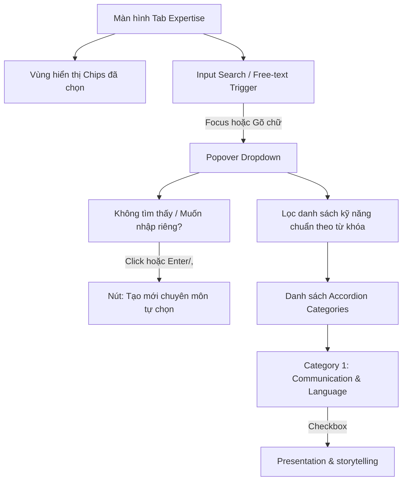

# Spec: Tích hợp API Tour Guide Skills với Klook-style Categorized Dropdown (Tab Expertise)

Tài liệu đặc tả thông số kỹ thuật (spec) và thiết kế trải nghiệm này hướng dẫn việc tích hợp API kỹ năng của Tour Guide (`/tour-guide/skills`) vào tab **Expertise** của màn hình **Edit Profile**, sử dụng giao diện chọn dạng Dropdown phân loại theo nhóm (Categorized Dropdown) lấy cảm hứng từ Klook.

Phân tích này được triển khai dựa trên cấu trúc của framework **BMAD** (Business, Market, Architecture, Design).

---

## 1. Business (Mục tiêu Kinh doanh & Giá trị)

- **Chuẩn hóa dữ liệu chuyên môn (Data Standardization):** Loại bỏ việc Tour Guide tự nhập văn bản tự do (Free-text) dẫn đến dữ liệu rác, sai chính tả (ví dụ: _Trenkking_ thay vì _Trekking_). Dữ liệu chuẩn giúp hệ thống xây dựng bộ lọc tìm kiếm (Search & Filter) và thuật toán đề xuất Tour Guide cho khách du lịch cực kỳ chính xác.
- **Tăng mức độ uy tín & tin cậy (Professionalism):** Hiển thị danh sách kỹ năng chuẩn hóa, phân nhóm khoa học giúp hồ sơ Tour Guide trông chuyên nghiệp và đáng tin cậy hơn, từ đó cải thiện tỷ lệ chuyển đổi đặt tour (Booking Conversion Rate).
- **Phân tích nhân lực (Talent Analytics):** Giúp hệ thống quản trị (Admin) thống kê được mức độ phân bổ kỹ năng của đội ngũ hướng dẫn viên trên toàn hệ thống để định hướng đào tạo hoặc tuyển dụng.

---

## 2. Market/User (Thị trường & Người dùng mục tiêu)

- **Đối tượng:** Tour Guides (Hướng dẫn viên/Chuyên gia địa phương).
- **Hành vi & Bối cảnh:** Thường thao tác trên điện thoại di động (Mobile-first). Rất ngại gõ bàn phím dài trên màn hình nhỏ.
- **Pain Points hiện tại:**
  - Form nhập cũ bắt gõ chữ rồi bấm `Enter` hoặc click `+ Add` khá rườm rà.
  - Guide không biết trên hệ thống có sẵn những kỹ năng nào để chọn cho đúng chuẩn.
- **User Needs:**
  - Một danh sách kỹ năng có sẵn, phân loại rõ ràng theo từng nhóm chuyên môn (ví dụ: Ngoại ngữ, Giải quyết sự cố, Chăm sóc khách hàng) để chỉ cần lướt qua và chọn (Scan & Tap).
  - Trải nghiệm chọn nhiều mục (Multi-select) nhanh chóng, mượt mà.

---

## 3. Architecture (Kiến trúc & Kỹ thuật)

### 3.1. API Contract

Hệ thống sẽ gọi API sau để lấy danh sách kỹ năng:

- **Endpoint:** `GET /tour-guide/skills`
- **Base URL:** `https://web-travel-be.fly.dev`
- **Headers:** `accept: application/json`
- **Response JSON Structure:**

```json
{
  "data": {
    "skillCategories": [
      {
        "code": "communication_language",
        "name": "Communication & Language",
        "displayOrder": 1,
        "skills": [
          {
            "code": "presentation_storytelling",
            "name": "Presentation & storytelling"
          },
          {
            "code": "foreign_languages",
            "name": "Foreign languages (English, Chinese, Korean, etc.)"
          }
        ]
      },
      {
        "code": "professional_knowledge",
        "name": "Professional Knowledge",
        "displayOrder": 2,
        "skills": [
          {
            "code": "history_culture_geography",
            "name": "History, culture & geography of destinations"
          }
        ]
      }
    ]
  },
  "code": 200,
  "message": "get tour guide skills succhessfully",
  "error": null
}
```

### 3.2. TypeScript Types (`src/api/tour-guide/types.ts`)

```typescript
export interface ApiSkill {
  code: string;
  name: string;
}

export interface ApiSkillCategory {
  code: string;
  name: string;
  displayOrder: number;
  skills: ApiSkill[];
}

export interface ApiTourGuideSkillsResponse {
  data: {
    skillCategories: ApiSkillCategory[];
  };
  code: number;
  message: string;
  error: string | null;
}
```

### 3.3. API Integration Layer (`src/api/tour-guide/requests.ts` & `queries.ts`)

- **`requests.ts`**:
  ```typescript
  export async function getTourGuideSkills(): Promise<ApiSkillCategory[]> {
    const { data } = await request.get<ApiTourGuideSkillsResponse>('/tour-guide/skills');
    return data.data.skillCategories;
  }
  ```
- **`queries.ts`**:
  Sử dụng React Query Kit để quản lý cache:
  ```typescript
  export const useTourGuideSkills = createQuery<ApiSkillCategory[], void>({
    primaryKey: '/tour-guide/skills',
    queryFn: () => getTourGuideSkills(),
    staleTime: 24 * 60 * 60 * 1000, // 24 giờ (danh sách kỹ năng rất ít khi thay đổi)
  });
  ```

### 3.4. Form State & Schema Mapping

Hiện tại, schema quản lý hồ sơ tour guide (`TourGuideFormValues`) lưu trữ mảng `experts` dưới dạng danh sách chuỗi: `experts: z.array(z.string())`.

Có hai phương án lưu trữ khi chọn từ API mới:

- **Phương án A (Lưu Skill Name - Khuyên dùng):** Lưu trực tiếp chuỗi tên kỹ năng hiển thị (ví dụ: `"Presentation & storytelling"`, `"Basic first aid"`).
  - _Ưu điểm:_ Tương thích ngược 100% với dữ liệu hiện tại trong DB. Các trang hiển thị Profile ngoài Frontend không cần sửa đổi logic map từ code sang tên.
- **Phương án B (Lưu Skill Code):** Lưu mã kỹ năng (ví dụ: `"presentation_storytelling"`, `"basic_first_aid"`).
  - _Ưu điểm:_ Chuẩn hóa tối đa, hỗ trợ đa ngôn ngữ (i18n) dễ dàng sau này.
  - _Nhược điểm:_ Phải viết thêm bộ mapping (Helper hoặc Component) ở tất cả những nơi hiển thị chuyên môn để dịch từ code sang tên hiển thị (cần tải danh sách kỹ năng về để map).

> [!IMPORTANT] > **Khuyến nghị giai đoạn này:** Sử dụng **Phương án A (Lưu Skill Name)** để tránh phá vỡ giao diện hiển thị hiện tại và không yêu cầu cập nhật cơ sở dữ liệu cũ. Khi lưu, ta lưu tên kỹ năng (ví dụ: `skill.name`) vào mảng `experts`. Dù kỹ năng được chọn từ API hay nhập thủ công, chúng đều được lưu dưới dạng chuỗi trong mảng này.

---

## 4. Design (UI/UX - Trải nghiệm Hybrid Dropdown & Free-text)

Giao diện mới của tab **Expertise** sẽ là sự kết hợp giữa **Klook-style Categorized Dropdown** và **Free-text Input** (nhập thủ công tự do). Điều này đảm bảo Guide vừa có danh sách chuẩn hóa để chọn nhanh, vừa có thể linh hoạt nhập các kỹ năng đặc thù chưa có sẵn trên hệ thống.



### 4.1. Cấu trúc Layout & Luồng tương tác

1.  **Vùng hiển thị Chips đã chọn (Selected Chips Area - Gom nhóm theo Response):**

    - Nằm cố định phía trên cùng.
    - **Gom nhóm hiển thị:** Các kỹ năng đã chọn sẽ được tự động phân loại và gom nhóm dưới các tiêu đề danh mục tương ứng lấy từ API response `skillCategories` (ví dụ: nhóm _"Communication & Language"_, nhóm _"Professional Knowledge"_).
    - **Nhóm tự chọn (Other Specialties):** Các kỹ năng do người dùng tự nhập thủ công (không nằm trong danh mục của API) sẽ được gom nhóm dưới tiêu đề _"Other Specialties"_ (hoặc _"Chuyên môn khác"_).
    - **Hiển thị có điều kiện:** Tiêu đề nhóm và danh sách các tag con bên trong chỉ hiển thị khi có ít nhất một kỹ năng thuộc nhóm đó được chọn. Bên cạnh tiêu đề nhóm sẽ hiển thị số lượng kỹ năng đang chọn trong nhóm, ví dụ: `Communication & Language (2)`.
    - Mỗi kỹ năng hiển thị dưới dạng một tag chip bo tròn (`rounded-full`) kèm nút `x` để xoá nhanh. Tất cả các chip vẫn sử dụng palette màu tự động từ `getSpecialtyColor`.

2.  **Ô nhập thông minh kiêm Dropdown Trigger (Smart Input Trigger):**

    - Là một ô nhập text (`<input>`) giống như giao diện hiện tại để người dùng có thể gõ chữ bất cứ lúc nào.
    - Khi **Focus** vào ô nhập này hoặc gõ ký tự đầu tiên, Popover Dropdown sẽ thả xuống bên dưới.
    - Gõ phím `Enter` hoặc dấu phẩy (`,`) hoặc bấm nút `+ Add` bên cạnh ô input sẽ thực hiện hành động **Thêm chuyên môn tự chọn** (nếu từ khóa đó chưa tồn tại trong danh sách đã chọn, nó sẽ tự động rơi vào nhóm _"Other Specialties"_).

3.  **Bảng lựa chọn thả xuống (Popover Dropdown Content - Gom nhóm theo Response):**
    - Sử dụng Radix UI Popover hoặc Command Menu để bo sát kích thước của ô trigger, thiết kế bo góc tròn mềm mại (`rounded-2xl`) cùng bóng đổ.
    - Bên trong Popover chia thành 2 trạng thái lọc:
      - **Khi ô nhập trống (Trạng thái tĩnh):** Hiển thị danh mục kỹ năng chuẩn hóa được **gom nhóm động** theo dữ liệu API response `skillCategories`. Mỗi nhóm được thể hiện dưới dạng một Klook-style Accordion:
        - Tiêu đề Accordion là tên của category (`category.name`).
        - Bên phải tiêu đề hiển thị số lượng kỹ năng đã chọn trong nhóm đó (ví dụ: `(2)` hoặc `(2/5)`), kèm icon Chevron để xoay mở/đóng.
        - Danh sách các kỹ năng con được hiển thị bên dưới với Checkbox chọn/bỏ chọn.
      - **Khi người dùng gõ tìm kiếm:**
        - Hệ thống tự động lọc các kỹ năng khớp từ khóa và chỉ hiển thị các nhóm (Accordion) có chứa kỹ năng khớp, đồng thời tự động mở rộng (auto-expand) các nhóm đó để hiển thị kết quả.
        - Nếu từ khóa tìm kiếm không khớp chính xác với bất kỳ kỹ năng chuẩn nào, một nút **"Tạo mới chuyên môn '[từ khóa]'"** (Create new expert) sẽ xuất hiện cố định ở dưới cùng Popover (ghim ở chân dropdown) để người dùng click thêm nhanh vào nhóm tự chọn.

### 4.2. Micro-interactions & Animations (`framer-motion`)

- **Accordion Slide-down:** Danh sách kỹ năng con bên trong mỗi Category trượt xuống mượt mà khi click mở rộng và cuộn êm ái.
- **Checkbox Tick:** Checkbox phản hồi nảy nhẹ (bounce scale) khi được chọn.
- **Chip Exit:** Khi xoá một tag bằng nút `x`, tag đó sẽ fade-out và thu nhỏ dần trước khi biến mất, giúp các tag còn lại dồn dịch mượt mà.

### 4.3. Phục hồi và Phòng thủ Trải nghiệm (Defensive UX)

- **API Loading State:** Trong lúc API đang tải danh sách kỹ năng, hiển thị Skeleton loader mờ ở vị trí dropdown để biểu thị đang tải dữ liệu.
- **API Error Fallback:** Nếu API bị lỗi mạng hoặc server sập, dropdown vẫn hoạt động ở chế độ **nhập thủ công tự do** và hiển thị một dòng thông báo nhỏ phía trên: _"Tải kỹ năng mẫu thất bại. Bạn vẫn có thể tự nhập chuyên môn của mình."_ kèm nút **"Retry"** thử lại.

---

## 5. Sáng kiến & Ý tưởng Mở rộng (Ideation via BMAD)

- **💡 Market: Đề xuất kỹ năng theo xu hướng (Trending Skills Suggestion):**
  - _Ý tưởng:_ Đánh dấu nhãn "🔥 Hot" hoặc "Recommended" bên cạnh một số kỹ năng đang được khách du lịch tìm kiếm nhiều gần đây (ví dụ: _personalized_experience_ hoặc _tech_use_).
  - _Giá trị:_ Khuyến khích Guide lựa chọn hoặc cải thiện những kỹ năng thực tế thị trường đang khát.
- **🎨 Design: Tìm kiếm nâng cao đa ngôn ngữ (Multilingual Search):**
  - _Ý tưởng:_ Dù giao diện đang hiển thị tiếng Anh hay tiếng Việt, khi Guide gõ tìm kiếm bằng tiếng Anh (ví dụ: _"history"_) hoặc tiếng Việt (ví dụ: _"lịch sử"_), hệ thống vẫn tự động lọc đúng kỹ năng `"History, culture & geography of destinations"`.
  - _Giá trị:_ Cực kỳ hữu ích cho các hướng dẫn viên địa phương vốn quen thuộc với thuật ngữ bản địa.
- **⚙️ Architecture: Offline cache dự phòng (Offline Fallback):**
  - _Ý tưởng:_ Lưu cứng một bản sao danh sách kỹ năng mặc định (Static fallback JSON) ngay trong code client. Nếu API bị lỗi và người dùng không có mạng, hệ thống vẫn hiển thị được danh sách tĩnh này để Guide tiếp tục làm việc.

---

## 6. Sửa lỗi vỡ giao diện (Broken UI Fixes & Specifications)

Dựa trên phân tích hình ảnh thực tế của giao diện khi mở Dropdown, các lỗi hiển thị (vỡ layout) hiện tại cần được khắc phục theo các thông số kỹ thuật sau:

### 6.1. Lỗi co rút chiều rộng (Width Constraint Issue)

- **Nguyên nhân:** Bảng Popover được neo (`PopoverAnchor`) vào duy nhất ô `<input>`. Vì ô `<input>` nằm trong một flex container và phải nhường chỗ cho nút `+ Add` bên phải, nên chiều rộng thực tế của nó rất hẹp. Thuộc tính `w-[var(--radix-popover-trigger-width)]` ép Popover co theo chiều rộng hẹp này, khiến nội dung bị bó chặt và che khuất dòng chữ gợi ý bên dưới.
- **Giải pháp khắc phục:**
  1.  **Di chuyển Anchor:** Gắn `PopoverAnchor` bao ngoài toàn bộ Container chứa cả ô `<input>` và nút `+ Add`. Điều này giúp Popover tự động mở rộng bằng toàn bộ chiều rộng của hàng nhập liệu.
  2.  **Thiết lập chiều rộng tối thiểu an toàn:** Cấu hình thuộc tính `min-w` của `PopoverContent` là `min-w-[340px]` (hoặc sử dụng `w-full` và điều chỉnh vị trí căn chỉnh) để đảm bảo trên các thiết bị màn hình nhỏ (từ 375px), dropdown vẫn hiển thị đầy đủ thông tin.

### 6.2. Lỗi cắt cụt văn bản dài (Text Wrapping / Clipping Issue)

- **Nguyên nhân:** Tên của các kỹ năng chuẩn hóa (ví dụ: _"Non-verbal communication (body language)"_) rất dài. Khi bị ép trong không gian hẹp, thẻ `<span>` hiển thị tên bị cắt cụt do flexbox tràn và thiếu thuộc tính cho phép xuống dòng.
- **Giải pháp khắc phục:**
  1.  **Cho phép xuống dòng:** Thêm các class Tailwind `whitespace-normal` và `break-words` vào thẻ `<span>` hiển thị nhãn của kỹ năng.
  2.  **Tối ưu cấu trúc flex:** Đảm bảo container của từng dòng kỹ năng (`button`) sử dụng `items-start` thay vì `items-center` để khi văn bản xuống dòng thứ 2, các thành phần icon (dấu check hoặc dot tròn) vẫn được căn thẳng hàng ở trên cùng một cách đẹp mắt.

### 6.3. Cải thiện khoảng cách và đệm (Padding & Spacing Refinements)

- **Giải pháp khắc phục:**
  1.  Tăng nhẹ `gap-2` hoặc `gap-3` giữa icon checkbox và text của kỹ năng.
  2.  Đặt `max-h-[300px]` thay vì `max-h-60` cho vùng cuộn dọc để hiển thị được nhiều kỹ năng hơn mà không bắt người dùng phải cuộn quá nhiều.
