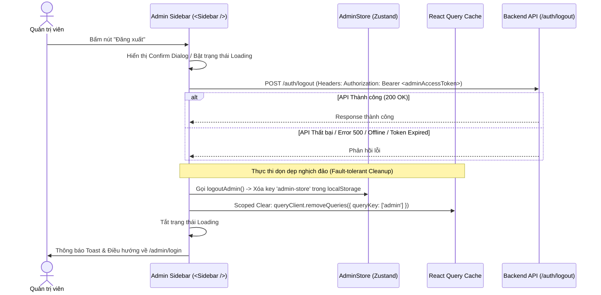

# Đặc tả tính năng Đăng xuất Quản trị (Admin Logout) & Quản lý Token Tách biệt (Isolated Token Storage)

Tài liệu này mô tả chi tiết giải pháp kiến trúc, luồng xử lý, cơ chế tự động làm mới Token (`Renew Token`), và đặc tả kỹ thuật cho tính năng **Đăng xuất (Logout) & Quản lý Session phía Admin** trong hệ thống Web Travel. Tài liệu được biên soạn dựa trên việc kế thừa và mở rộng chuẩn mực đang có trong hệ thống (`UserStore`, `useLogout`, `axios.ts`) và tuân thủ theo phương pháp **\_bmad** (đề cao sự tối giản KISS, tính thực tế YAGNI, không lặp lại DRY và Tư duy nghịch đảo Inversion Thinking).

---

## 1. Bối cảnh & Phân tích Giải pháp Lưu trữ Token Quốc tế (Global Best Practices Analysis)

### 1.1. Thách thức trong hệ thống đa vai trò (Multi-Role Auth)

Trong ứng dụng Web Travel, người dùng (Quản trị viên) có thể mở đồng thời cả trang **Client** (Dành cho khách hàng/hướng dẫn viên) và trang **Admin Dashboard** trên cùng một trình duyệt (Domain / Origin).

- **Thách thức:** Nếu cả Admin và Client dùng chung một key trong `localStorage` (ví dụ: `user-store` hoặc `accessToken`), sẽ xảy ra các vấn đề nghiêm trọng:
  1. **Xung đột ghi đè Token (Token Overwrite Collision):** Khi Admin đăng nhập ở tab này, Token Admin sẽ ghi đè Token Khách hàng ở tab kia.
  2. **Dọn dẹp quá đà (Accidental Cross-Session Purge):** Khi Admin bấm Đăng xuất, nếu ứng dụng thực hiện `localStorage.clear()` hoặc reset `useUserStore`, phiên làm việc Client của người dùng sẽ bị xóa oan.
  3. **Rò rỉ quyền hạn (Security Scope Pollution):** Axios Interceptor có thể vô tình gửi Token Quản trị (mang quyền cao nhất) cho các API công khai phía Client.

---

### 1.2. So sánh 3 Mô hình Tách biệt Token từ các Nền tảng Quốc tế

| Tiêu chí       | Mô hình 1: Cookie Path Scoping<br>_(Auth0 / Supabase / Enterprise)_                          | Mô hình 2: Dedicated Subdomains<br>_(Shopify / Stripe)_                         | Mô hình 3: Isolated Store & Storage Key Namespacing<br>_(Vercel / Modern SPA)_                                       |
| :------------- | :------------------------------------------------------------------------------------------- | :------------------------------------------------------------------------------ | :------------------------------------------------------------------------------------------------------------------- |
| **Cơ chế**     | Backend set HTTP-Only Cookie với `Path=/admin` cho Token Admin và `Path=/` cho Client Token. | Sử dụng subdomain riêng biệt (ví dụ: `admin.webtravel.com` vs `webtravel.com`). | Tạo 2 Zustand Store riêng biệt (`UserStore` & `AdminStore`), lưu dưới 2 key riêng trong `localStorage`.              |
| **Ưu điểm**    | - Bảo mật tối đa (chống XSS).<br>- Browser tự động gửi đúng cookie theo path URL.            | - Tách biệt hoàn toàn 100% Context, Origin, CORS và Storage.                    | - Phù hợp tuyệt đối với cấu trúc Next.js SPA/SSR hiện tại.<br>- Dễ triển khai, không cần đổi cấu trúc Infra/Backend. |
| **Nhược điểm** | Phụ thuộc hoàn toàn vào cấu hình Set-Cookie từ Backend API.                                  | Tốn chi phí setup Domain/SSL và cấu hình CORS/OAuth phức tạp.                   | Cần quản lý Axios Interceptor để chọn đúng Header Bearer theo route.                                                 |
| **Đánh giá**   | Rất tốt nếu Backend hỗ trợ Cookie HTTP-Only.                                                 | Phức tạp không cần thiết cho quy mô hiện tại (Vi phạm YAGNI).                   | **LỰA CHỌN TỐI ƯU (Best Fit cho Web Travel)**                                                                        |

---

## 2. Giải pháp Kiến trúc & Đồng bộ Pattern Hệ thống

Dựa trên cấu trúc hiện có của hệ thống (`UserStore.ts`, `axios.ts`, `useLogout.ts`), Web Travel áp dụng **Mô hình 3: Isolated Store & Storage Key Namespacing**, đảm bảo đồng nhất 100% về cách viết code và luồng xử lý nhưng được quy hoạch riêng cho phân vùng Admin.

```
                           ┌─────────────────────────────────────────┐
                           │            Local Browser                │
                           └────────────────────┬────────────────────┘
                                                │
                       ┌────────────────────────┴────────────────────────┐
                       ▼                                                 ▼
        ┌─────────────────────────────┐                   ┌─────────────────────────────┐
        │        user-store           │                   │         admin-store         │
        │ (Zustand: useUserStore)     │                   │ (Zustand: useAdminStore)    │
        ├─────────────────────────────┤                   ├─────────────────────────────┤
        │ - accessToken               │                   │ - adminAccessToken          │
        │ - refreshToken              │                   │ - adminRefreshToken         │
        │ - user (Client/Guide)       │                   │ - adminUser (Admin)         │
        └─────────────────────────────┘                   └─────────────────────────────┘
```

---

## 3. Đặc tả Kỹ thuật & Luồng xử lý Đăng xuất Admin (Technical Specifications)

### 3.1. Luồng xử lý Đăng xuất (Sequence Diagram - Inversion Thinking)

Áp dụng **Tư duy Nghịch đảo (Inversion Thinking)**: Mục tiêu tối hậu của đăng xuất là **làm sạch triệt để trạng thái Client**, bất kể API Backend phản hồi thành công, báo lỗi hay mất kết nối mạng.



---

### 3.2. Đặc tả API Endpoints (Swagger Verified)

#### 1. API Logout (`POST /auth/logout`)

- **URL:** `POST /auth/logout`
- **Headers:** `Authorization: Bearer <adminAccessToken>`
- **Response Format (200 OK):**
  ```json
  {
    "data": null,
    "code": 200,
    "error": null,
    "message": "logout success"
  }
  ```

#### 2. API Renew Access Token (`POST /auth/access-token/renew`)

- **URL:** `POST /auth/access-token/renew`
- **Request Body:**
  ```json
  {
    "refreshToken": "string"
  }
  ```
- **Response Format (200 OK):**
  ```json
  {
    "data": {
      "accessToken": "eyJhbGciOi...",
      "refreshToken": "eyJhbGciOi...",
      "user": {
        "id": "3fa85f64-5717-4562-b3fc-2c963f66afa6",
        "name": "Admin User",
        "email": "admin@example.com",
        "role": "admin"
      }
    },
    "code": 200,
    "error": null,
    "message": "get new access token"
  }
  ```

---

### 3.3. Chi tiết Mã nguồn theo Pattern có sẵn trong Hệ thống

#### 1. Định nghĩa Admin Store (`src/stores/AdminStore.ts`)

_Cách làm giống hệt `src/stores/UserStore.ts`, chỉ đổi key `persist` thành `'admin-store'`._

```typescript
import { createSelectorFunctions } from 'auto-zustand-selectors-hook';
import { create } from 'zustand';
import { createJSONStorage, persist } from 'zustand/middleware';

import type { ILoginResponse, IUser } from '@/api/auth';

export interface IAdminQueryStore {
  adminUser: IUser;
  adminAccessToken: string;
  adminRefreshToken?: string;
  setAdminStore: (data: ILoginResponse) => void;
  setAdminAccessToken: (data: string) => void;
  logoutAdmin: () => void;
}

const useBaseAdminStore = create<IAdminQueryStore>()(
  persist(
    (set) => ({
      adminAccessToken: '',
      adminRefreshToken: undefined,
      adminUser: {} as IUser,
      setAdminStore: (data) =>
        set(() => ({
          adminAccessToken: data.accessToken,
          adminRefreshToken: data.refreshToken,
          adminUser: data.user,
        })),
      setAdminAccessToken: (data) => set((state) => ({ ...state, adminAccessToken: data })),
      logoutAdmin: () =>
        set(() => ({
          adminAccessToken: '',
          adminRefreshToken: undefined,
          adminUser: {} as IUser,
        })),
    }),
    {
      name: 'admin-store', // Tách biệt hoàn toàn với 'user-store'
      storage: createJSONStorage(() => localStorage),
    }
  )
);

export const useAdminStore = createSelectorFunctions(useBaseAdminStore);
```

---

#### 2. Hook Đăng xuất Admin (`src/hooks/useAdminLogout.ts`)

_Cách làm giống hệt `src/hooks/useLogout.ts`, kế thừa `useLogoutMutation` nhưng dọn dẹp `AdminStore` và `queryClient` scoped._

```typescript
import { useQueryClient } from '@tanstack/react-query';
import { useRouter } from 'next/router';

import { useLogoutMutation } from '@/api/auth';
import { useAdminStore } from '@/stores/AdminStore';
import { ROUTE } from '@/types';

export function useAdminLogout() {
  const router = useRouter();
  const queryClient = useQueryClient();
  const logoutAdmin = useAdminStore.use.logoutAdmin();
  const { mutate, isLoading } = useLogoutMutation();

  const handleAdminLogout = () => {
    mutate(undefined, {
      onSettled: () => {
        // Dọn dẹp local state bất kể API thành công hay thất bại (Fault-tolerance)
        logoutAdmin();
        // Chỉ xoá cache liên quan tới Admin, giữ nguyên cache Client nếu có
        queryClient.removeQueries({ queryKey: ['admin'] });
        router.push(ROUTE.ADMIN_LOGIN || '/admin/login');
      },
    });
  };

  return { handleAdminLogout, isLoading };
}
```

---

#### 3. Xử lý Interceptors & Renew Token trong Axios (`src/api/axios.ts`)

_Bổ sung cơ chế tự động Refresh Token cho Admin khi nhận mã lỗi 401 trên các route Admin:_

```typescript
// Thêm hàm refresh token dành riêng cho Admin
const onAdminRefreshToken = async (): Promise<string | null> => {
  const store = useAdminStore.getState();
  const refreshToken = store?.adminRefreshToken;

  if (!refreshToken) {
    store.logoutAdmin();
    Router.replace('/admin/login');
    return null;
  }

  try {
    const data = await refreshTokenRequest(refreshToken); // Gọi POST /auth/access-token/renew
    store.setAdminStore(data);
    return data.accessToken;
  } catch (e) {
    store.logoutAdmin();
    Router.replace('/admin/login');
    return null;
  }
};

// Cập nhật Request Interceptor
request.interceptors.request.use(
  async (config: InternalAxiosRequestConfig) => {
    const isAuthEndpoint = config.url?.startsWith('/auth/');
    const isLogout = config.url === '/auth/logout';

    if (isAuthEndpoint && !isLogout) {
      return config;
    }

    const isAdminRoute = Router.pathname.startsWith('/admin') || config.url?.startsWith('/admin/');
    const token = isAdminRoute ? useAdminStore.getState().adminAccessToken : useUserStore.getState().accessToken;

    if (token) {
      config.headers.Authorization = `Bearer ${token}`;
    }
    return config;
  },
  (error) => Promise.reject(error)
);
```

---

#### 4. Sử dụng thực tế tại Admin Sidebar (`src/components/layouts/AdminLayout/Sidebar.tsx`)

_Thay thế nút dummy cũ ở Sidebar Footer bằng Hook `useAdminLogout`:_

```tsx
import { LogOut, Loader2 } from 'lucide-react';
import { useAdminLogout } from '@/hooks/useAdminLogout';

// Bên trong component Sidebar Footer:
const { handleAdminLogout, isLoading } = useAdminLogout();

return (
  <div className="border-t border-gray-200 dark:border-gray-800 p-[16px]">
    <button
      onClick={handleAdminLogout}
      disabled={isLoading}
      className="flex w-full items-center gap-[16px] rounded-xl px-[20px] py-[14px] text-sm font-medium text-red-600 hover:bg-red-50 dark:text-red-400 dark:hover:bg-red-950/30 transition-colors disabled:opacity-50"
    >
      {isLoading ? (
        <Loader2 className="h-[24px] w-[24px] animate-spin flex-shrink-0" />
      ) : (
        <LogOut className="h-[24px] w-[24px] flex-shrink-0" />
      )}
      <span className={cn(isCollapsed ? 'hidden group-hover/sidebar:inline-block' : 'inline-block')}>
        {t('logout')}
      </span>
    </button>
  </div>
);
```

---

## 4. Đặc tả Giao diện (UI) & Trải nghiệm Người dùng (WOW UX)

### 4.1. Vị trí nút Đăng xuất trên Admin Sidebar Footer

- Vị trí: Chân trang Sidebar (`Sidebar Footer`).
- Biểu tượng: `LogOut` icon từ `lucide-react` (khi loading chuyển thành `Loader2` quay tròn).
- Hiệu ứng: `hover:bg-red-50 text-red-600 dark:hover:bg-red-950/30` cùng hiệu ứng `whileTap={{ scale: 0.97 }}` của Framer Motion.

### 4.2. Logout Confirmation Dialog (Hộp thoại xác nhận)

Để tránh rủi ro người dùng vô tình bấm nhầm nút Đăng xuất khi đang sửa sản phẩm / tour:

- **Tiêu đề:** "Xác nhận Đăng xuất"
- **Nội dung:** "Bạn có chắc chắn muốn đăng xuất khỏi trang quản trị Web Travel không?"
- **Hành động:** [Hủy bỏ] (giữ nguyên trang) và [Đăng xuất] (Màu đỏ Destructive, gọi `handleAdminLogout`).

---

## 5. Kế hoạch Kiểm thử & Xác minh (Verification Criteria)

| Mã ca test    | Tên Ca Kiểm Thử                            | Các Bước Thực Hiện                                                                                   | Kết Quả Mong Đợi                                                                                                                                                                                   |
| :------------ | :----------------------------------------- | :--------------------------------------------------------------------------------------------------- | :------------------------------------------------------------------------------------------------------------------------------------------------------------------------------------------------- |
| **TC-ADM-01** | Đăng xuất Admin (Mạng bình thường)         | 1. Bấm Đăng xuất tại Admin Sidebar.<br>2. Xác nhận trên Confirmation Dialog.                         | 1. Call API `POST /auth/logout` gửi kèm `adminAccessToken`.<br>2. Key `'admin-store'` bị xoá khỏi localStorage.<br>3. React Query Cache `['admin']` bị xóa.<br>4. Redirect mượt về `/admin/login`. |
| **TC-ADM-02** | Đăng xuất Admin khi Lỗi Mạng / Server 500  | 1. Mở DevTools ngắt kết nối mạng (Offline).<br>2. Bấm Đăng xuất Admin.                               | 1. API logout thất bại.<br>2. Client **vẫn** thực thi xóa `'admin-store'` cục bộ.<br>3. Redirect thành công về `/admin/login`.                                                                     |
| **TC-ADM-03** | Tự động Renew Access Token khi 401         | 1. Đồ hết hạn Admin Token.<br>2. Thực hiện thao tác trên Admin.                                      | 1. Axios tự gọi `POST /auth/access-token/renew` đính kèm `adminRefreshToken`.<br>2. Cập nhật `adminAccessToken` mới vào `useAdminStore`.<br>3. Retry request gốc thành công không bị gián đoạn.    |
| **TC-ADM-04** | Kiểm tra Tách biệt Session (Admin vs User) | 1. Đăng nhập User ở Tab 1.<br>2. Đăng nhập Admin ở Tab 2.<br>3. Thực hiện Đăng xuất ở Tab 2 (Admin). | 1. Key `'admin-store'` bị xóa.<br>2. Key `'user-store'` ở Tab 1 **vẫn còn nguyên**.<br>3. Tab 1 không bị ảnh hưởng và User vẫn đăng nhập bình thường.                                              |
| **TC-ADM-05** | Đồng bộ Đăng xuất Đa Tab (Multi-tab Sync)  | 1. Mở Admin Dashboard trên cả Tab A và Tab B.<br>2. Đăng xuất tại Tab A.                             | 1. Key `'admin-store'` bị xoá.<br>2. Tab B phát hiện sự kiện `storage` event và tự động chuyển hướng về `/admin/login`.                                                                            |
