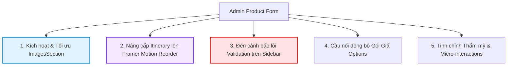

# Brainstorming & Specification: Admin Product Form Enhancements

Tài liệu này tổng hợp kết quả phân tích (Audit) hiện trạng mã nguồn của màn hình **Admin Product Form (`src/modules/AdminProduct/ProductFormPage`)**, những "viên ngọc ẩn" (components đã viết nhưng chưa tích hợp) và đề xuất các giải pháp nâng cấp toàn diện về mặt **Trải nghiệm người dùng (UX)**, **Tính năng (Features)** và **Giao diện (UI)** để đưa form này đạt đẳng cấp Premium, đúng theo triết lý TailAdmin.

---

## 1. Phân Tích & Đánh Giá Hiện Trạng (Form Audit)

Qua rà soát chi tiết mã nguồn, màn hình `ProductFormPage` hiện tại có cấu trúc rất vững chắc:

- **Cơ chế Điều hướng Scroll-Spy:** Tận dụng hook `useScrollSpy` và Menu Sticky trượt mượt mà theo các thẻ `SectionCard`.
- **Cơ chế Khôi Phục Bản Nháp (Auto-Save Draft):** Tích hợp qua `useProductDraft` giúp lưu tạm dữ liệu vào LocalStorage chống mất dữ liệu rất thông minh.
- **Hoạt họa Drag-to-Reorder:** Sử dụng thư viện `framer-motion` cho các phần tử như Banner Video (`BannerSection`) và Trải nghiệm (`ExperiencesSection`).

### 🔍 Những "Viên Ngọc Ẩn" Chưa Được Kích Hoạt

1. **`ImagesSection` (`images-section.tsx`):**
   - **Hiện trạng:** Component này đã được xây dựng vô cùng chuyên nghiệp (gồm upload Ảnh đại diện/Thumbnail, Ảnh lịch trình/ItineraryImage, nút Tải nhiều ảnh/Bulk Upload, và bộ kéo thả reorder ảnh gallery `GalleryItem`).
   - **Vấn đề:** **Hoàn toàn bị bỏ quên trong file chính `index.tsx`**. Hiện tại Admin khi tạo/sửa Tour không thể tải lên bất kỳ hình ảnh hay ảnh đại diện nào!
2. **`OptionsSection` (`options-section.tsx`):**
   - **Hiện trạng:** Hệ thống giá theo gói (Adult, Child, Infant) dạng Grid Spreadsheet siêu nhanh kèm tính năng khóa tiền tệ (Currency Lock) đã được code xong.
   - **Vấn đề:** Bị comment-out do giao diện người dùng bên ngoài (Client Detail) chưa hiển thị gói giá. Điều này vô tình làm mất đi tính năng thiết lập giá sâu của hệ thống Admin.

---

## 2. Đề Xuất Cải Tiến Toàn Diện (Enhancement Specification)

Để hoàn thiện và nâng tầm màn hình này, chúng tôi đề xuất 5 cải tiến cốt lõi dưới đây:



### 🚀 Cải tiến 1: Tích hợp sẵn `ImagesSection` dưới dạng Comment (Pre-integrated & Commented Out)

- **Mục tiêu:** Tích hợp sẵn khung quản lý hình ảnh vào form chính nhưng để ở trạng thái **commented out** (ẩn đi) theo yêu cầu của bạn, giúp dễ dàng kích hoạt chỉ bằng cách bỏ comment trong tương lai.
- **Giải pháp:**
  - Import `ImagesSection` trong `index.tsx` nhưng để trong block comment.
  - Thêm phần tử tương ứng của `ImagesSection` vào `NAV_SECTIONS` và phần render main content dưới dạng comment.

### 📐 Cải tiến 1.1: Tái cấu trúc Layout Product Overview cân đối (Premium Balanced Layout)

- **Mục tiêu:** Sắp xếp lại các trường thông tin trong phần "Product Overview" để đạt độ cân đối hoàn hảo về mặt thị giác, giải quyết hiện tượng lệch dòng và tối ưu diện tích hiển thị (được truyền cảm hứng từ bố cục cân bằng của Hình 2).
- **Giải pháp:**
  - **Dòng 1 (Name & Slug):** Sử dụng `grid grid-cols-2 gap-5` để chia chính xác **50% - 50%** cho Tour Name và URL Path.
  - **Dòng 2 (Selects):** Giữ nguyên `grid grid-cols-3 gap-5` cho Destination, Supplier và Tour Guide.
  - **Dòng 3 (Price & Video):** Gộp Starting Price và Tour Video trực tiếp vào một dòng mới với `grid grid-cols-2 gap-5`, đảm bảo chiều cao của 2 ô input luôn thẳng hàng ngang tuyệt đối.
  - **Dòng 4 (Short Description) & Dòng 5 (Highlights):** Chuyển từ cột dọc chia đôi hẹp thành **100% full-width** trên 2 dòng riêng biệt. Bố cục này giúp ô TextArea rộng rãi, hiển thị trọn vẹn văn bản và tạo cảm giác cực kỳ thoáng đãng, cân đối tương tự như ô Description của Hình 2.

### 📹 Cải tiến 1.2: Phân Tích & Cấu Hình Tối Ưu Trình Phát Video (Video Player Architectural Decision)

- **Mục tiêu:** Video lúc mới mở trang sẽ ở trạng thái **tạm dừng (paused)** để tránh gây phiền nhiễu cho Admin, nhưng khi người dùng tự tay nhấn nút phát (play) thì video sẽ phát **đầy đủ âm thanh (unmuted)**.
- **Phân Tích So Sánh Hai Giải Pháp (iframe vs. BunnyVideoPlayer):**

  Qua rà soát kỹ lưỡng cấu trúc mã nguồn hiện tại của dự án, chúng tôi đã đưa ra một quyết định kiến trúc quan trọng:

| Tiêu chí                     | Giải pháp A: Dùng `BunnyVideoPlayer` tích hợp                                                                                                                                                                                                                                  | Giải pháp B: Dùng `iframe` tối ưu hóa tham số (Khuyên Dùng)                                                              |
| :--------------------------- | :----------------------------------------------------------------------------------------------------------------------------------------------------------------------------------------------------------------------------------------------------------------------------- | :----------------------------------------------------------------------------------------------------------------------- |
| **Bản chất**                 | Tái sử dụng component `BunnyVideoPlayer` của Client                                                                                                                                                                                                                            | Dùng thẻ `<iframe>` nhúng trực tiếp, tối ưu hóa qua query string                                                         |
| **Độ phức tạp**              | Rất cao, cần thêm overlay nút bấm và xử lý state play/pause                                                                                                                                                                                                                    | Cực kỳ thấp, gọn nhẹ và đáng tin cậy 100%                                                                                |
| **Tương tác Video Pool**     | ⚠️ **Xấu:** Component này gọi hook `useSharedVideo` - lấy phần tử từ Video Pool dùng chung (chỉ có đúng 5 elements). Nếu Admin mở trang và tải nhiều video banner cùng lúc (>5 video), **Video Pool sẽ bị cạn kiệt (exhausted)** dẫn đến crash hoặc không hiển thị được video. | ✅ **Hoàn hảo:** Hoạt động hoàn toàn độc lập dưới dạng sandbox, không đụng chạm vào Video Pool dùng chung của Client.    |
| **Quyền kiểm soát âm thanh** | Kiểm soát trực tiếp bằng code React thông qua ref handle.                                                                                                                                                                                                                      | Bunny CDN Player tự xử lý âm thanh khi Admin click trực tiếp vào nút phát (nút Play nằm bên trong iframe).               |
| **Bảo mật (Cross-Origin)**   | Không bị ảnh hưởng vì là HTML5 video thô của chính domain.                                                                                                                                                                                                                     | Bị chặn nếu cha điều khiển con bằng code, nhưng **cho phép tuyệt đối** nếu người dùng tự click phát trên nút của iframe. |

- **Quyết định Kỹ thuật (Architectural Decision):**
  Chúng ta thống nhất chọn **Giải pháp B (Dùng iframe tối ưu hóa tham số)**. Đây là phương án an toàn nhất, độc lập với Video Pool và không gây ra bất kỳ side-effect nào cho ứng dụng.

- **Giải pháp chi tiết:**

  - Trong component `BannerVideoUpload.tsx`, chúng ta sẽ viết một hàm tiện ích `getOptimizedEmbedUrl` để đảm bảo link nhúng Bunny CDN luôn đi kèm tham số **`autoplay=false`** (để video ở trạng thái pause lúc mới mở trang) và **KHÔNG** bật tham số `muted=true` (hoặc đặt `muted=false`).
  - Khi Admin click trực tiếp vào nút Play của trình phát Bunny CDN (nằm trong iframe), trình duyệt ghi nhận đó là cử chỉ thực tế của người dùng đối với frame đó và cho phép phát **đầy đủ âm thanh**.
  - Cập nhật hàm `getOptimizedEmbedUrl` và phần render `iframe` trong `BannerVideoUpload.tsx` như sau:

    ```tsx
    const getOptimizedEmbedUrl = (url: string): string => {
      if (!url) return '';
      try {
        const urlObj = new URL(url);
        urlObj.searchParams.set('autoplay', 'false');
        urlObj.searchParams.set('loop', 'true');
        // Không truyền muted=true để mặc định phát có tiếng khi Admin click Play
        urlObj.searchParams.delete('muted');
        return urlObj.toString();
      } catch (e) {
        // Fallback an toàn nếu chuỗi URL không hợp chuẩn
        const separator = url.includes('?') ? '&' : '?';
        return `${url}${separator}autoplay=false&loop=true`;
      }
    };

    // Trong renderDropzone:
    <iframe
      src={getOptimizedEmbedUrl(value)}
      className="w-full h-full absolute inset-0 border-0"
      allow="autoplay; fullscreen"
      allowFullScreen
    />;
    ```

  - Khắc phục các đoạn code Việt hóa còn sót để đồng bộ sang giao diện Tiếng Anh cao cấp:
    - `"Ảnh đại diện (Thumbnail)"` ➔ `"Product Thumbnail Image"`
    - `"Ảnh lịch trình"` ➔ `"Itinerary Map Image"`
    - `"Bộ ảnh tour"` ➔ `"Product Gallery"`
    - `"Tải nhiều ảnh"` ➔ `"Bulk Upload"`
    - `"Thêm slot"` ➔ `"Add Slot"`
  - Tích hợp hiệu ứng xem trước ảnh mượt mà khi hover vào các thẻ ảnh.

### 🔄 Cải tiến 2: Đồng bộ hóa Trải nghiệm Kéo thả Lịch trình (Itinerary Drag-to-Reorder)

- **Mục tiêu:** Thay thế bộ kéo thả HTML5 thô sơ trong `TimeItinerarySection` bằng Framer Motion `Reorder` mượt mà như `ExperiencesSection`.
- **Giải pháp:**
  - Nâng cấp `TimeItinerarySection.tsx` sử dụng `<Reorder.Group>` và `<Reorder.Item>` từ thư viện `framer-motion`.
  - Thiết kế nút nắm kéo (Drag Handle) bằng icon `GripVertical` hoặc `Menu` tinh tế bên góc trái mỗi dải thẻ Lịch trình.
  - Thêm hiệu ứng nâng nhẹ (scale-up & shadow) khi Admin đang giữ và di chuyển một ngày lịch trình để tạo cảm giác phản hồi xúc giác (tactile feedback).

### 🚨 Cải tiến 3: Hệ thống Chỉ Báo Lỗi Thông Minh trên Sidebar (Validation Warning Badges)

- **Mục tiêu:** Khi Admin nhấn "Publish" hoặc "Save Changes" và Form bị lỗi validation ở các trường ở quá sâu bên dưới, Sidebar Scroll-Spy sẽ dẫn lối ngay lập tức thay vì bắt người dùng tự cuộn đi tìm lỗi.
- **Giải pháp:**
  - Truy xuất trạng thái lỗi từ react-hook-form: `const { errors } = form.formState;`.
  - Ánh xạ lỗi của các field về từng Section tương ứng. Ví dụ:
    - Nếu lỗi `name` hoặc `slug` ➔ Đánh dấu lỗi cho phần `section-overview`.
    - Nếu lỗi trong mảng `itineraries` ➔ Đánh dấu lỗi cho phần `section-itinerary`.
  - Trên Sidebar, nếu section nào có lỗi validation, hiển thị thêm một dấu chấm tròn đỏ nhẹ (`animate-pulse`) hoặc một icon cảnh báo nhỏ màu đỏ kế bên tên Section trên Menu giúp định vị lỗi tức thì.

### 💰 Cải tiến 4: Tái hòa nhập & Chuẩn hóa Gói Giá (`OptionsSection`)

- **Mục tiêu:** Mang chức năng tạo nhiều gói bán (Vé người lớn, trẻ em, em bé) trở lại để đảm bảo tính năng đầy đủ của hệ thống quản lý Tour.
- **Giải pháp:**
  - Tích hợp `OptionsSection` thành một SectionCard có ID là `section-options` nằm ngay dưới `QuickFactsSection` (Configuration).
  - Tự động đồng bộ trường `minPrice` ở phần thông tin cơ bản bằng giá trị `adultPrice` thấp nhất của các Gói giá để giữ tính nhất quán cho dữ liệu hiển thị ngoài Frontend.
  - Sử dụng định dạng tiền tệ tự động thêm dấu phẩy phân cách phần nghìn (`1,000,000` VND) khi Admin gõ giá trị vào các ô nhập liệu giúp giảm thiểu sai sót gõ nhầm số `0`.

### ✨ Cải tiến 5: Nâng tầm Thẩm mỹ & Tương tác vi mô (Clean UI Transitions)

- **Mục tiêu:** Làm cho form phản hồi mượt mà, chuyên nghiệp và có cảm giác cao cấp mà không màu mè.
- **Giải pháp:**
  - **TinyMCE Border Glow:** Thêm lớp phủ CSS tùy biến cho khung viền của trình soạn thảo TinyMCE trong `DetailsSection`. Khi người dùng click chọn soạn thảo, phần viền ngoài sẽ sáng nhẹ lên màu xanh brand (`ring-4 ring-brand-500/10 border-brand-400`).
  - **Skeleton Loading:** Khi tải dữ liệu Tour cũ để sửa (`isEdit === true`), áp dụng hiệu ứng Shimmer Skeleton cho toàn bộ thẻ Form thay vì hiển thị màn hình trống hoặc loader xoay tròn truyền thống.

### 🧱 Cải tiến 5.2: Khắc Phục Lỗi Hở Viền & Đè Chồng Của Banner Thông Báo (Draft Recovery Banner Stacking Bug)

- **Vấn đề (Lỗi hở viền ở trên khi cuộn):**
  - Trong giao diện hiện tại, khi cuộn trang xuống, thanh tiêu đề `ProductFormHeader` (`Edit Tour`) sẽ neo lại (`sticky top-[72px]`).
  - Tuy nhiên, banner thông báo phục hồi bản nháp `DraftRecoveryBanner` (`Unsaved draft`) được khai báo **phía dưới** `ProductFormHeader` trong cấu trúc DOM.
  - Do thứ tự DOM này, khi cuộn trang, banner `DraftRecoveryBanner` (ở dạng static block) di chuyển lên trên và **đè chồng lên phía trên** thanh tiêu đề đang bị neo, chui qua khoảng hở giữa `AdminHeader` (sticky top-0) và `ProductFormHeader` (sticky top-72px), làm lộ văn bản bị che khuất một nửa rất mất mỹ quan (như ảnh chụp màn hình).
- **Giải pháp triệt để:**

  - **Thay đổi thứ tự render trong DOM:** Đưa `DraftRecoveryBanner` lên khai báo **phía trên** `ProductFormHeader` trong file `src/modules/AdminProduct/ProductFormPage/index.tsx`.
  - **Cơ chế hoạt động mới:** Khi cuộn trang, banner `DraftRecoveryBanner` sẽ tự động cuộn lên và ẩn hoàn toàn bên dưới thanh tiêu đề chính `AdminHeader` (`z-40`, `bg-white`) một cách tự nhiên. Thanh tiêu đề `ProductFormHeader` khi cuộn lên sẽ bám sát bên dưới `AdminHeader` (`top-[72px]`), loại bỏ hoàn toàn hiện tượng chồng lấn hoặc hở chữ.
  - Cập nhật cấu trúc trong `index.tsx`:

    ```tsx
    return (
      <div className="flex flex-col min-h-full bg-gray-50 dark:bg-gray-900">
        {/* Đưa Banner phục hồi lên đầu tiên trong DOM */}
        {showDraftBanner && (
          <DraftRecoveryBanner
            onRestore={() => {
              draft.restoreDraft();
              setShowDraftBanner(false);
            }}
            onDiscard={() => {
              draft.discardDraft();
              setShowDraftBanner(false);
            }}
          />
        )}

        {/* Thanh tiêu đề sticky bám sát ngay dưới */}
        <ProductFormHeader
          isEdit={isEdit}
          productId={productId}
          currentStatus={currentStatus}
          lastSaved={draft.lastSaved}
          isPending={isPending}
          onSaveDraft={handleSaveDraft}
          onSaveChanges={handleSaveChanges}
          onPublish={handlePublish}
          onHide={handleHide}
        />
    ```

---

## 3. Bản Đồ Thay Đổi File Dự Kiến (Proposed File Changes)

Để hiện thực hóa các đề xuất trên, các file sau đây sẽ được điều chỉnh:

### 1. `src/modules/AdminProduct/ProductFormPage/index.tsx`

- Tích hợp `ImagesSection` (và cả `OptionsSection`) vào `NAV_SECTIONS` và phần hiển thị chính dưới dạng **code comment sẵn** (không hiển thị lên UI mặc định, giúp dễ dàng bỏ comment và dùng sau này).
- Kết nối `form.formState.errors` với menu Scroll-Spy để hiển thị chỉ báo lỗi màu đỏ.

### 1.1. `src/modules/AdminProduct/ProductFormPage/components/sections/basic-info-section.tsx`

- Tái cấu trúc layout lưới (grid) từ chia đôi cột dọc thành các dòng ngang cân bằng: Name/Slug (2 cột 50-50), Price/Video (2 cột 50-50), Short Description (100% full-width), Highlights (100% full-width).

### 2. `src/modules/AdminProduct/ProductFormPage/components/sections/time-itinerary-section.tsx`

- Tái cấu trúc bộ drag-and-drop từ HTML5 thô sang `framer-motion` `Reorder`.
- Thêm hiệu ứng kéo thả mượt mà cho các ngày trong Lịch trình.

### 3. `src/modules/AdminProduct/ProductFormPage/components/sections/images-section.tsx`

- Việt hóa sang Anh hóa chuẩn quốc tế (`Ảnh đại diện` ➔ `Thumbnail`, v.v.).
- Thêm tooltip giải thích kích thước ảnh tối ưu cho Thumbnail và Gallery.

### 4. `src/components/ui/price-input.tsx` (Hoặc tạo mới nếu chưa có)

- Tích hợp thư viện định dạng số hoặc hàm format RegExp để hiển thị số tiền dạng `15,000,000` trực quan trong lúc gõ phím.
