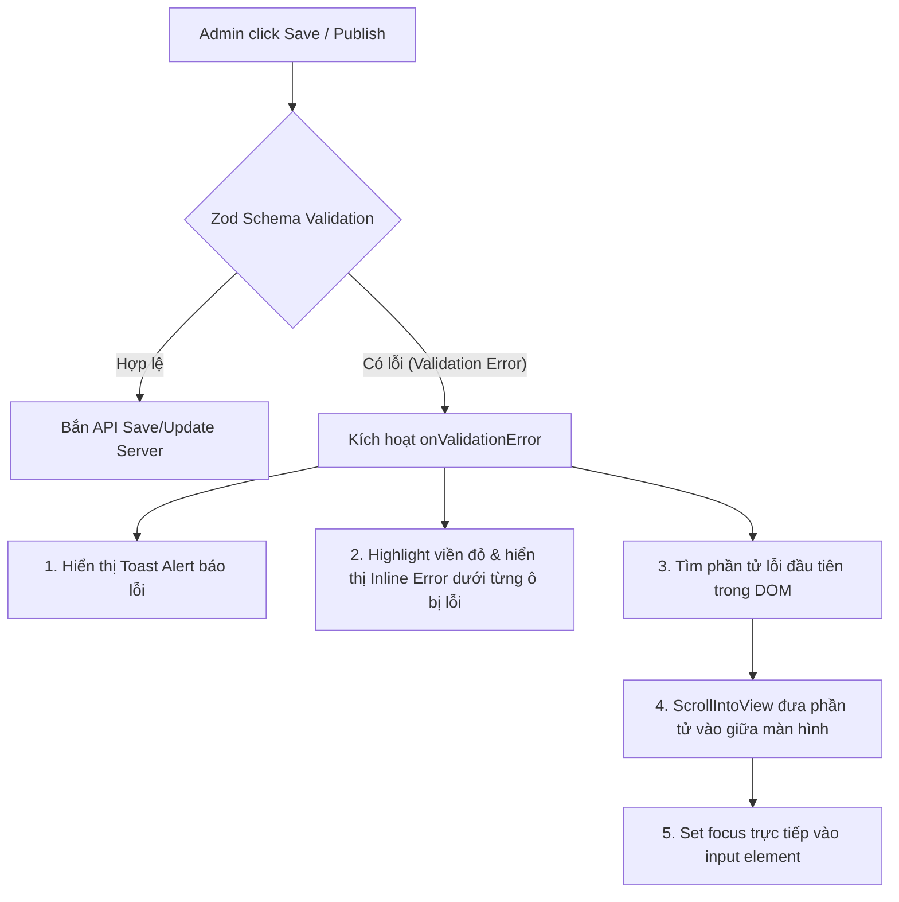

# Đặc tả Kỹ thuật: Quy Chuẩn Xử Lý Lỗi Validation & Focus Trực Tiếp Trường Nhập Dữ Liệu (Field-Level Error & Auto-Focus Spec)

**Màn hình áp dụng:** Admin Product Form (`src/modules/AdminProduct/ProductFormPage`)  
**Đối tượng:** Admin/Operator quản lý Sản phẩm Tour  
**Trạng thái:** Published Standard Spec

---

## 1. Bối Cảnh & Mục Tiêu UX

### 1.1. Hiện Trạng & Vấn Đề (Problem Statement)

- **Thông báo lỗi chung chung (Generic Toast):** Khi nhấn **[Save Changes]** hoặc **[Publish]** mà chưa nhập đủ dữ liệu bắt buộc (Required Fields), hệ thống chỉ hiển thị thông báo chung ở trên cùng: _"Please fill in all required fields before saving"_. Người dùng không biết chính xác trường nào bị thiếu hoặc không đúng định dạng.
- **Không tự động di chuyển đến ô lỗi:** Người dùng phải tự cuộn lăn chuột trên form dài (12 sections) để dò tìm trường có ô vuông viền đỏ.
- **Giao diện ô nhập "Location name" thiếu nhất quán:** Trong danh sách địa điểm đón (`Pickup Locations`), phần "Location name" hiện tại được hiển thị dạng chữ tiêu đề không có khung viền ô nhập (borderless inline header input), khác biệt so với các ô text box của "Address" và "Map URL". Điều này khiến người dùng khó nhận biết đây là một ô input độc lập cần gõ dữ liệu.

```
[Trước khi cải tiến]
Location name (không viền, nằm ở header thẻ card) -> Dễ nhìn nhầm là label tĩnh
Address (có text box viền xám)
Map URL (có text box viền xám)

[Sau khi cải tiến]
Location Name * [Text box có viền & label rõ ràng] -> Báo đỏ + Thông báo lỗi inline bên dưới khi rỗng
Address         [Text box có viền]
Map URL         [Text box có viền]
```

### 1.2. Mục Tiêu Giải Pháp

1. **Chuẩn hóa Giao diện Ô Nhập "Location Name":** Đưa ô "Location name" thành một Text Box hoàn chỉnh, có Label, viền khung (Border),Placeholder và Trạng thái Focus đồng bộ tuyệt đối với trường "Address" và "Map URL".
2. **Thông báo lỗi cụ thể cho từng trường (Inline Field Error Messages):** Mọi trường bắt buộc nếu chưa điền sẽ có viền đỏ nổi bật (`border-red-400` / `ring-red-100`) kèm dòng chữ giải thích lỗi ngay dưới ô nhập (VD: _"Location name is required"_).
3. **Tự động Cuộn & Focus trực tiếp (Auto-Scroll & Direct Field Focus):** Ngay khi bấm Submit mà có lỗi Validation, màn hình tự động cuộn (smooth scroll) đưa vị trí lỗi đầu tiên vào giữa màn hình và đặt con trỏ chuột (`.focus()`) vào ô nhập đó để Admin gõ dữ liệu ngay lập tức.

---

## 2. Quy Chuẩn Kỹ Thuật (Detailed Technical Requirements)



### 2.1. Chuẩn Hóa Component `PickupCard` (`pickup-card.tsx`)

#### Quy cách hiển thị UI:

- **Cấu trúc Thẻ Card:**
  - Header: Hiển thị thứ tự địa điểm (`Location #1`), Nút gắn thẻ Phổ biến (Star), Nút Xóa (Trash).
  - Body: Chứa 3 nhóm trường dạng stacked vertical inputs (mỗi nhóm gồm Label + Input Box + Inline Error Text):
    1. **Location Name \*** (Text Box bắt buộc)
    2. **Address** (Text Box tùy chọn)
    3. **Map URL** (Text Box tùy chọn)

#### Logic Validation & Báo lỗi Inline:

- Điều kiện lỗi: `const nameError = isSubmitted && !row.name.trim();`
- Thuộc tính accessibility: `aria-invalid={nameError ? true : undefined}`
- Styling khi lỗi:
  - Input: `border-red-400 text-red-600 focus-visible:ring-red-400 placeholder:text-red-300`
  - Inline error text: `<p className="text-[11px] text-red-500 mt-1 font-medium">Location name is required</p>`

---

### 2.2. Cơ Chế Auto-Scroll & Focus Trực Tiếp Khi Thất Bại Validation

#### Nguyên lý thực thi:

Trong hàm xử lý sự kiện `onValidationError` của Form (`ProductFormPage/index.tsx` & `useProductForm.ts`):

```typescript
const scrollToFirstError = () => {
  setTimeout(() => {
    // Tìm phần tử bị lỗi đầu tiên trong DOM theo thứ tự từ trên xuống dưới
    const firstInvalidElement = document.querySelector<HTMLElement>(
      '[aria-invalid="true"], .border-red-300, .border-red-400, .border-red-500, input:invalid, textarea:invalid'
    );

    if (firstInvalidElement) {
      // 1. Smooth Scroll đưa trường lỗi vào tâm nhìn người dùng
      firstInvalidElement.scrollIntoView({ behavior: 'smooth', block: 'center' });

      // 2. Set focus trực tiếp vào ô input để bật bàn phím / con trỏ soạn thảo ngay
      firstInvalidElement.focus({ preventScroll: true });
    }
  }, 100);
};
```

---

## 3. Danh Sách Ma Trận Validation Các Trường Trên Form

| Section              | Trường dữ liệu (Field) | Điều kiện Validation             | Inline Error Message          | Behavior khi Submit Lỗi                      |
| :------------------- | :--------------------- | :------------------------------- | :---------------------------- | :------------------------------------------- |
| **Pickup Locations** | `name` (Location Name) | Không được rỗng khi đã thêm dòng | _"Location name is required"_ | Scroll tới Card + Focus vào ô input Name     |
| **Service Packages** | `title` (Package Name) | Không được rỗng khi đã thêm gói  | _"Package name is required"_  | Scroll tới Option Card + Focus ô input Title |
| **Product Overview** | `name` (Tour Name)     | Trống hoặc > 500 ký tự           | _"Product name is required"_  | Scroll tới top section + Focus ô Tour Name   |
| **Product Overview** | `slug` (URL Path)      | Không được rỗng                  | _"URL path is required"_      | Scroll tới top section + Focus ô Slug        |
| **Departures**       | `time`                 | Không đúng định dạng `HH:mm`     | _"Time is required"_          | Scroll tới Departure Row + Focus ô Time      |
| **Units**            | `name`                 | Không được rỗng                  | _"Unit name is required"_     | Scroll tới Unit Row + Focus ô Name           |

---

## 4. Kế Hoạch Kiểm Thử (Verification & QA Checklist)

- [x] **Test UI Pickup Location:** Mở section Pickup Locations -> Kiểm tra ô "Location Name" có khung viền Text Box hiển thị đầy đủ, đồng nhất với "Address".
- [x] **Test Validation Inline:** Để trống "Location Name" và bấm **[Save Changes]** -> Kiểm tra viền ô chuyển sang đỏ và có dòng chữ _"Location name is required"_ màu đỏ ngay bên dưới.
- [x] **Test Auto-Scroll & Direct Focus:** Cuộn màn hình xuống cuối trang hoặc mở phần khác -> Nhấn **[Publish]** -> Màn hình tự động cuộn lên đúng ô thiếu dữ liệu đầu tiên và con trỏ nhấp nháy ngay trong ô input đó.
