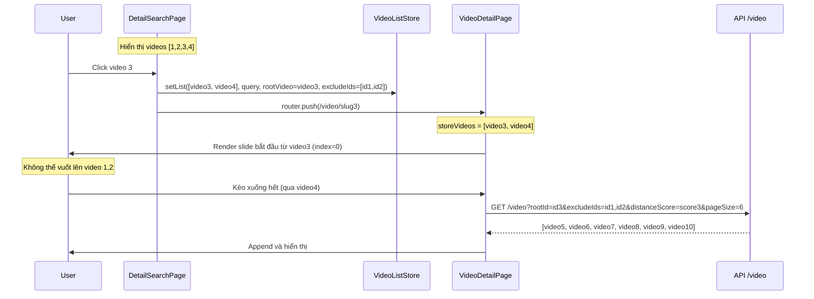
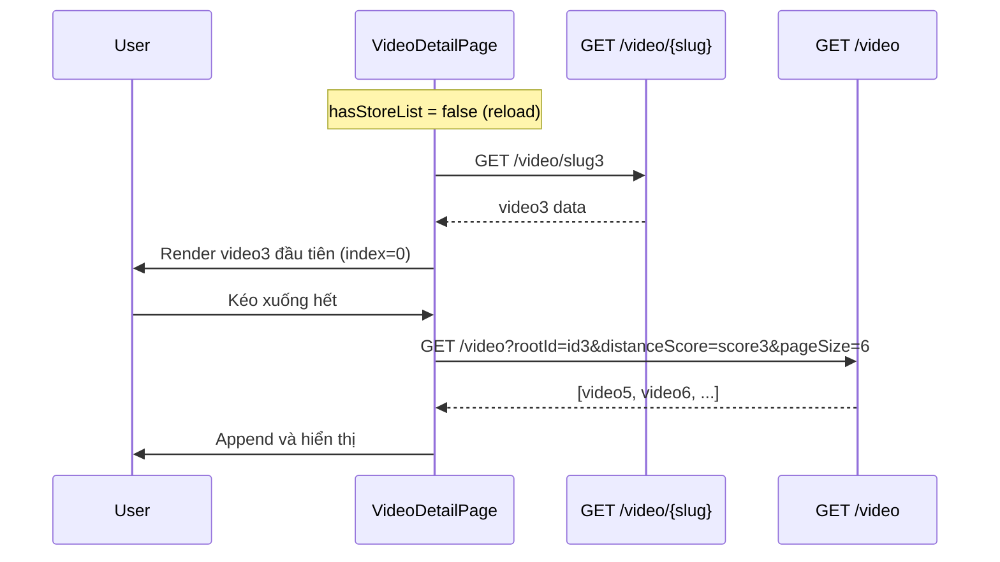

# Spec: VideoDetailPage — Navigation từ DetailSearchPage & Infinite Scroll mới

> **Trạng thái**: 🟡 Draft — chờ review
> **Cập nhật lần cuối**: 2026-03-12

---

## 1. Mục tiêu

Cải thiện trải nghiệm `VideoDetailPage` theo 3 case:

| #   | Case                            | Mô tả                                                                                            |
| --- | ------------------------------- | ------------------------------------------------------------------------------------------------ |
| 1   | **Navigate từ SearchPage**      | Video được click luôn là video đầu tiên của slide; không thể vuốt ngược lên video trước đó       |
| 2   | **Infinite scroll tiếp theo**   | Khi kéo hết danh sách, dùng `rootId` + `excludeIds` + `distanceScore` của video gốc để load thêm |
| 3   | **Reload trang (hard refresh)** | Dùng `slug` trên URL để fetch video đó qua `GET /video/{slug}`, dùng làm video đầu tiên          |

---

## 2. Phân tích trạng thái hiện tại

### 2.1 Flow hiện tại (trước spec này)

```
DetailSearchPage
  → handleVideoClick(id)
      → setList(videos, query)       ← toàn bộ list từ search
      → router.push(/video/{slug})

VideoDetailPage
  → hasStoreList = true
  → videos = storeVideos             ← [1, 2, 3, 4, ...]
  → initialIndex = findIndex(slug)   ← ví dụ index=2 (video 3)
  → scroll đến video 3
  → user vẫn CÓ THỂ kéo lên video 1, 2
```

**Vấn đề**: User có thể vuốt ngược lên các video 1, 2 trước video được chọn. Đây không phải trải nghiệm mong muốn.

### 2.2 Vấn đề reload

Hiện tại khi `!hasStoreList` (reload), `VideoDetailPage` fetch `getListVideo` không có `rootId`/`excludeIds`, nên danh sách không khớp với context ban đầu.

---

## 3. Thiết kế mới

### 3.1 Store: `VideoListStore` — thêm metadata

Cần bổ sung 2 trường vào store để VideoDetailPage biết video gốc:

```typescript
// src/stores/VideoListStore.ts
interface IVideoListStore {
  videos: IVideo[];
  query: string | undefined;
  rootVideo: IVideo | null; // ← MỚI: video được click (video "gốc")
  setList: (videos: IVideo[], query?: string, rootVideo?: IVideo) => void;
  clear: () => void;
}
```

### 3.2 DetailSearchPage/VideoGrid — thay đổi `handleVideoClick`

**File**: `src/modules/DetailSearchPage/components/VideoGrid.tsx`

```typescript
const handleVideoClick = useCallback(
  (id: string) => {
    const video = videos.find((v) => v.id === id);
    if (!video) return;

    // Tìm index của video được click
    const clickedIndex = videos.findIndex((v) => v.id === id);

    // Lấy các videos từ video được click trở đi (cắt bỏ các video trước đó)
    const videosFromClicked = videos.slice(clickedIndex);

    // Lưu store: chỉ từ video được click trở đi + đánh dấu rootVideo
    setList(videosFromClicked, query, video);

    router.push(`/video/${video.slug}`);
  },
  [router, videos, query, setList]
);
```

> **Kết quả**: VideoDetailPage nhận `storeVideos = [video3, video4]` → video3 luôn ở index 0 → không thể vuốt lên video trước.

### 3.3 VideoDetailPage — Case 1: Navigate từ SearchPage

**File**: `src/modules/VideoDetailPage/index.tsx`

Không cần thay đổi nhiều — vì store đã chỉ chứa videos từ video được click, `initialIndex` sẽ luôn là 0.

```
storeVideos = [video3, video4]
initialIndex = findIndex(slug=video3) = 0  ✅
```

Tuy nhiên cần **giữ thêm distanceScore của rootVideo** để dùng cho infinite scroll (xem Case 2).

---

### 3.4 VideoDetailPage — Case 2: Infinite Scroll tiếp theo

Khi user kéo hết `storeVideos` (ví dụ hết video4), cần fetch thêm.

**Tham số truyền vào API `GET /video`**:

| Param           | Giá trị                                            | Ý nghĩa                          |
| --------------- | -------------------------------------------------- | -------------------------------- |
| `query`         | `storeQuery`                                       | Từ khóa tìm kiếm ban đầu         |
| `rootId`        | `rootVideo.id`                                     | ID của video được click (video3) |
| `excludeIds`    | IDs của tất cả videos TRƯỚC video được click       | Ví dụ: [id1, id2]                |
| `distanceScore` | `distanceScore` của rootVideo trong kết quả search | Cursor từ lần search trước       |
| `pageSize`      | 6                                                  | Số video mỗi batch               |

**Vấn đề**: Hiện tại `IVideo` không lưu `distanceScore` (chỉ lưu ở `IVideoPage.nextCursor` là score của video cuối cùng). Cần lưu score của từng video hoặc ít nhất của rootVideo.

#### Phương án: Lưu `distanceScore` vào `IVideo`

```typescript
// src/api/video/types.ts
export interface IVideo {
  id: string;
  slug: string;
  title: string;
  link: string;
  shortUrl: string;
  thumbnail: string;
  description: string;
  likeCount: number;
  distanceScore?: number; // ← MỚI: raw score từ API
}

// Mapper
const toVideo = (item: ApiVideoItem): IVideo => ({
  // ...existing fields...
  distanceScore: item.score, // ← map từ item.score
});
```

#### Store — thêm `excludeIds`

```typescript
interface IVideoListStore {
  videos: IVideo[];
  query: string | undefined;
  rootVideo: IVideo | null;
  excludeIds: string[]; // ← MỚI: IDs của videos trước rootVideo
  setList: (videos: IVideo[], query?: string, rootVideo?: IVideo, excludeIds?: string[]) => void;
  clear: () => void;
}
```

Khi `handleVideoClick`:

```typescript
const clickedIndex = videos.findIndex((v) => v.id === id);
const excludeIds = videos.slice(0, clickedIndex).map((v) => v.id);
const videosFromClicked = videos.slice(clickedIndex);

setList(videosFromClicked, query, video, excludeIds);
```

#### API mới cho infinite scroll của VideoDetailPage

Cần bổ sung params `rootId` và `excludeIds` vào `getVideoPage`:

```typescript
// src/api/video/types.ts
export interface IVideoVariablesInfinite {
  query?: string;
  pageSize?: number;
  distanceScore?: number;
  rootId?: string; // ← MỚI
  excludeIds?: string[]; // ← MỚI
}
```

```typescript
// src/api/video/requests.ts
export const getVideoPage = async (variables?: IVideoVariablesInfinite): Promise<IVideoPage> => {
  const pageSize = variables?.pageSize ?? DEFAULT_PAGE_SIZE;
  const { data } = await request<ApiVideoListResponse>({
    url: '/video',
    method: 'GET',
    params: {
      pageSize,
      ...(variables?.query && { query: variables.query }),
      ...(variables?.distanceScore !== undefined && { distanceScore: variables.distanceScore }),
      ...(variables?.rootId && { rootId: variables.rootId }),
      ...(variables?.excludeIds?.length && { excludeIds: variables.excludeIds }),
    },
  });
  // ...existing mapping
};
```

#### VideoDetailPage — hook infinite scroll mới

```typescript
// src/modules/VideoDetailPage/index.tsx

const storeRootVideo = useVideoListStore.use.rootVideo();
const storeExcludeIds = useVideoListStore.use.excludeIds();

// Infinite load cho VideoDetailPage (có storeList)
const {
  data: infiniteData,
  fetchNextPage,
  hasNextPage,
  isFetchingNextPage,
} = useInfiniteListVideo({
  variables: {
    query: storeQuery,
    rootId: storeRootVideo?.id,
    excludeIds: storeExcludeIds,
    // distanceScore của rootVideo để làm cursor ban đầu
  },
  enabled: hasStoreList, // chỉ dùng khi đến từ SearchPage
});
```

> **Lưu ý**: Batch đầu tiên của VideoDetailPage infinite sẽ dùng `distanceScore` của `rootVideo` làm cursor → API trả về các videos tiếp theo sau video gốc.

**Flow load thêm**:

```
storeVideos (từ SearchPage) = [video3, video4]
                                               ↓ kéo hết
fetchNextPage({
  rootId: video3.id,
  excludeIds: [id1, id2],
  distanceScore: video3.distanceScore,  ← cursor của video3
  query: storeQuery,
  pageSize: 6
})
→ API trả về: [video5, video6, video7, video8, video9, video10]
→ Append vào danh sách
```

---

### 3.5 VideoDetailPage — Case 3: Reload (Hard Refresh)

Khi reload, `storeVideos` bị xóa (`hasStoreList = false`). Cần:

1. Đọc `slug` từ URL
2. Fetch `GET /video/{slug}` → lấy video gốc
3. Video đó là video đầu tiên (index 0) của slide
4. Khi kéo xuống → dùng `id` + `distanceScore` của video đó làm cursor

```typescript
// src/modules/VideoDetailPage/index.tsx

// Đã có:
const { data: slugVideo } = useVideoBySlug({
  variables: { slug: currentSlug },
  enabled: !!currentSlug && !hasStoreList,
});

// Khi reload: slugVideo là video đầu tiên
const rootVideoOnReload = slugVideo ?? null;

// Infinite scroll sau reload
const {
  data: reloadInfiniteData,
  fetchNextPage: reloadFetchNextPage,
  hasNextPage: reloadHasNextPage,
} = useInfiniteListVideo({
  variables: {
    rootId: rootVideoOnReload?.id,
    distanceScore: rootVideoOnReload?.distanceScore,
    pageSize: 6,
  },
  enabled: !!rootVideoOnReload && !hasStoreList,
});
```

**Response của `GET /video/{slug}`**:

```json
{
  "data": {
    "id": "6cbd853f-...",
    "name": "Du lịch Miền Trung - Nha Trang",
    "slug": "du-lich-mien-trung-nha-trang-6cbd",
    "url": "...",
    "shortUrl": "...",
    "thumbnail": "...",
    "description": "...",
    "tag": null,
    "like": 5678
  }
}
```

> ⚠️ **Lưu ý**: API `/video/{slug}` không trả về `score`/`distanceScore`. Cần xác nhận với backend xem có thể thêm field `score` vào response không. Nếu không có, lần đầu kéo xuống sẽ không dùng cursor (gọi không có `distanceScore`) và nhận batch đầu tiên.

---

## 4. API Contract tổng hợp

### 4.1 `GET /video/{slug}` — Fetch video theo slug

```
GET https://web-travel-be.fly.dev/video/du-lich-mien-trung-nha-trang-6cbd
```

**Response**: Như ví dụ trong yêu cầu — `data.id`, `data.slug`, `data.url`, `data.shortUrl`, `data.thumbnail`, `data.like`.

> Mapper hiện tại đã có `getVideoBySlug` → `toVideo`. Field `score` chưa có trong response này.

### 4.2 `GET /video` — Load list tiếp theo

```
GET /video?query=...&rootId=VIDEO3_ID&excludeIds=ID1,ID2&distanceScore=VIDEO3_SCORE&pageSize=6
```

| Param           | Type     | Bắt buộc | Mô tả                                                       |
| --------------- | -------- | -------- | ----------------------------------------------------------- |
| `query`         | string   | ❌       | Từ khóa (từ SearchPage)                                     |
| `rootId`        | string   | ❌       | ID của video gốc (video được click hoặc video trong URL)    |
| `excludeIds`    | string[] | ❌       | IDs của videos cần loại trừ (videos trước video được click) |
| `distanceScore` | number   | ❌       | Cursor từ video gốc                                         |
| `pageSize`      | number   | ✅       | Mặc định 6                                                  |

---

## 5. Data Flow tổng hợp

### Case 1 & 2: Navigate từ SearchPage



### Case 3: Reload



---

## 6. Các thay đổi file

| File                                                    | Thay đổi                                                                                        |
| ------------------------------------------------------- | ----------------------------------------------------------------------------------------------- |
| `src/api/video/types.ts`                                | Thêm `distanceScore?` vào `IVideo`; thêm `rootId?`, `excludeIds?` vào `IVideoVariablesInfinite` |
| `src/api/video/requests.ts`                             | Mapper `toVideo` lưu `score`; `getVideoPage` nhận thêm `rootId`, `excludeIds`                   |
| `src/stores/VideoListStore.ts`                          | Thêm `rootVideo`, `excludeIds` vào store                                                        |
| `src/modules/DetailSearchPage/components/VideoGrid.tsx` | `handleVideoClick`: slice videos từ clicked index, truyền `rootVideo` + `excludeIds` vào store  |
| `src/modules/VideoDetailPage/index.tsx`                 | Dùng `useInfiniteListVideo` cho cả 2 mode (store & reload); truyền đúng tham số cursor          |

---

## 7. Open Questions

| #   | Câu hỏi                                                   | Trạng thái                                    |
| --- | --------------------------------------------------------- | --------------------------------------------- |
| 1   | API `/video/{slug}` có trả về `score` không?              | ⚠️ Chưa rõ — cần kiểm tra với backend         |
| 2   | API `/video` có nhận `rootId` và `excludeIds[]` không?    | ⚠️ Chưa rõ — xem swagger có field này không   |
| 3   | `excludeIds` truyền dạng gì? `ids=a&ids=b` hay `ids=a,b`? | ⚠️ Cần kiểm tra — swagger ghi `array[string]` |
