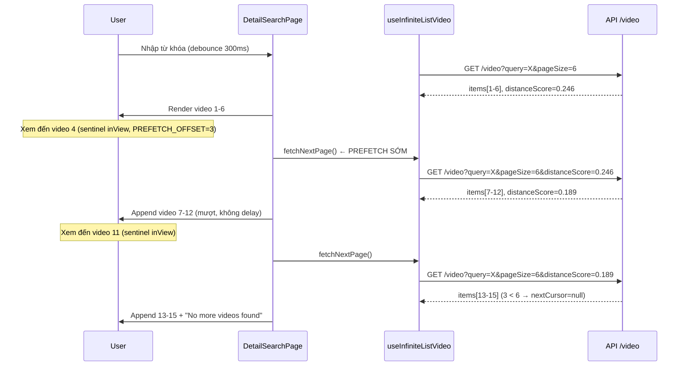

# Spec: Infinite Scroll với `distanceScore` — `DetailSearchPage`

> **Trạng thái**: 🟢 Đã chốt — sẵn sàng implement
> **Cập nhật lần cuối**: 2026-03-05

---

## 1. Mục tiêu

Thay thế page-based pagination hiện tại bằng **cursor-based infinite scroll** dùng `distanceScore` làm con trỏ, đảm bảo trải nghiệm lướt mượt mà không bị gián đoạn.

---

## 2. API Contract

### Request

```
GET /video?query=Miền Bắc&pageSize=6
GET /video?query=Miền Bắc&pageSize=6&distanceScore=0.246  ← lần thứ 2 trở đi
```

| Param           | Type   | Bắt buộc | Mô tả                                                |
| --------------- | ------ | -------- | ---------------------------------------------------- |
| `query`         | string | ✅       | Từ khóa tìm kiếm                                     |
| `pageSize`      | number | ✅       | Số video mỗi lần tải. **Mặc định: 6**                |
| `distanceScore` | number | ❌       | Cursor từ response trước, **không truyền ở lần đầu** |

### Response

```json
{
  "data": {
    "items": [
      { "id": "...", "score": 0.192, ... },
      { "id": "...", "score": 0.246, ... }
    ],
    "stats": {
      "distanceScore": 0.24681030930372827
    }
  },
  "code": 200,
  "message": "ok",
  "error": null
}
```

### Cơ chế cursor

```
Batch 1 response:  data.stats.distanceScore = 0.246
                                    ↑
                         nextCursor = 0.246

Batch 2 request:  GET /video?distanceScore=0.246
                  → API trả về các items tiếp theo
```

### Điều kiện hết data ✅ Đã chốt

`items.length < pageSize` → `nextCursor = null` → hiển thị **"No more videos found"**

---

## 3. Quyết định đã chốt

| #   | Quyết định                  | Giá trị                                                             |
| --- | --------------------------- | ------------------------------------------------------------------- |
| 1   | `pageSize` mặc định         | **6** video / lần                                                   |
| 2   | Thông báo hết data          | **"No more videos found"** (tiếng Anh)                              |
| 3   | Điều kiện hết               | `items.length < pageSize`                                           |
| 4   | Prefetch strategy           | Trigger `fetchNextPage` khi user **đang xem video N-3**             |
| 5   | Video cũ khi scroll ngược   | **Giữ nguyên** — append-only, không replace                         |
| 6   | `useListVideo` cũ           | **Giữ** — dùng cho VideoDetailPage. Tách `getListVideoPage` mới     |
| 7   | Reset khi đổi query         | **Debounce 300ms** — SearchInput hiện không có debounce             |
| 8   | Loading UI cuối list        | **6 skeleton cards** — nhất quán với skeleton hiện có               |
| 9   | VideoDetailPage data source | **Fetch riêng theo `ids[]`** — cần API `GET /video?ids=id1,id2,...` |

---

## 4. Prefetch Strategy ✅ Đã chốt

```
Batch hiện tại: [1, 2, 3*, 4, 5, 6]
                      ↑
               Sentinel ở đây (index N-3)
               → fetch batch tiếp ngay khi user xem video 3-4
               → [7, 8, 9, 10, 11, 12] sẵn sàng trước khi cần
```

- **`PREFETCH_OFFSET = 3`** ✅: gắn `IntersectionObserver` vào video thứ `videos.length - 3`
- Khi user đang xem video **3 hoặc 4** → trigger `fetchNextPage()` ngay lập tức
- 6 video tiếp theo đã load xong trước khi user scroll tới → **zero loading gap**

---

## 5. Các thay đổi kỹ thuật

### 5.1 `src/api/video/types.ts`

```typescript
// Thêm mới
export interface ApiVideoStats {
  distanceScore: number;
}

export interface ApiVideoPageResult {
  items: ApiVideoItem[];
  stats: ApiVideoStats;
}

export interface IVideoPage {
  items: IVideo[];
  nextCursor: number | null; // null = hết data
}

// Sửa IVideoVariables: bỏ page, thêm distanceScore
export interface IVideoVariables {
  query?: string;
  pageSize?: number;
  distanceScore?: number; // cursor; undefined = lần đầu
}
```

### 5.2 `src/api/video/requests.ts`

Tách thành 2 functions riêng biệt — giữ nguyên `getListVideo` cho VideoDetailPage:

```typescript
const DEFAULT_PAGE_SIZE = 6; // ✅ chốt

// Giữ nguyên cho VideoDetailPage (trả về IVideo[])
export const getListVideo = async (variables?: IVideoVariables): Promise<IVideo[]> => {
  const { data } = await request<ApiResponse<ApiVideoPageResult>>({
    url: '/video',
    method: 'GET',
    params: {
      pageSize: variables?.pageSize ?? DEFAULT_PAGE_SIZE,
      ...(variables?.query && { query: variables.query }),
      ...(variables?.distanceScore !== undefined && { distanceScore: variables.distanceScore }),
    },
  });
  return data.data.items.map(toVideo);
};

// Mới cho infinite scroll (trả về IVideoPage với cursor)
export const getVideoPage = async (variables?: IVideoVariables): Promise<IVideoPage> => {
  const pageSize = variables?.pageSize ?? DEFAULT_PAGE_SIZE;
  const { data } = await request<ApiResponse<ApiVideoPageResult>>({
    url: '/video',
    method: 'GET',
    params: {
      pageSize,
      ...(variables?.query && { query: variables.query }),
      ...(variables?.distanceScore !== undefined && { distanceScore: variables.distanceScore }),
    },
  });

  const items = data.data.items.map(toVideo);
  return {
    items,
    nextCursor: items.length < pageSize ? null : data.data.stats?.distanceScore ?? null,
  };
};
```

### 5.3 `src/api/video/queries.ts`

```typescript
// Giữ useListVideo cũ (VideoDetailPage dùng)
export const useListVideo = createQuery<IVideo[], IVideoVariables>({
  primaryKey: '/video',
  queryFn: ({ queryKey: [, variables] }) => getListVideo(variables),
});

// Thêm hook infinite mới cho DetailSearchPage
export const useInfiniteListVideo = createInfiniteQuery<
  IVideoPage,
  IVideoVariables,
  Error,
  number | undefined // TPageParam: undefined lần đầu, number lần sau
>({
  primaryKey: '/video/infinite',
  queryFn: ({ queryKey: [, variables], pageParam }) => getVideoPage({ ...variables, distanceScore: pageParam }),
  getNextPageParam: (lastPage) => lastPage.nextCursor ?? undefined,
  initialPageParam: undefined,
});
```

### 5.4 `src/modules/DetailSearchPage/index.tsx`

```typescript
const PREFETCH_OFFSET = 3; // ✅ chốt

// Debounce query 300ms ✅
const [inputValue, setInputValue] = useState(() => (typeof q === 'string' ? q : ''));
const [query, setQuery] = useState(inputValue);

useEffect(() => {
  const timer = setTimeout(() => setQuery(inputValue), 300);
  return () => clearTimeout(timer);
}, [inputValue]);

const { data, isLoading, isFetchingNextPage, fetchNextPage, hasNextPage } = useInfiniteListVideo({
  variables: { query: query || undefined },
  enabled: router.isReady, // fetch cả khi không có query (hiển thị videos mặc định)
});

const videos = data?.pages.flatMap((page) => page.items) ?? [];
```

> **Lưu ý**: `enabled: router.isReady` (không check `!!query`) — giữ nguyên behavior hiện tại, hiển thị videos mặc định khi không có từ khóa.

### 5.5 `src/modules/DetailSearchPage/components/VideoGrid.tsx`

Thêm props:

- `hasNextPage: boolean`
- `isFetchingMore: boolean`
- `onLoadMore: () => void`
- Gắn sentinel ref vào card ở `index === videos.length - PREFETCH_OFFSET`

```tsx
{
  /* Skeleton khi đang fetch thêm */
}
{
  isFetchingMore && (
    <div className="grid grid-cols-2 gap-[2px] w-full">
      {Array.from({ length: 6 }).map((_, i) => (
        <div key={i} className="aspect-[3/4] w-full bg-neutral-100 animate-pulse" />
      ))}
    </div>
  );
}

{
  /* End of data */
}
{
  !hasNextPage && !isLoading && videos.length > 0 && (
    <p className="col-span-2 text-center text-gray-400 text-sm py-6">No more videos found</p>
  );
}
```

### 5.6 `src/modules/VideoDetailPage/index.tsx` ✅ Giữ nguyên hiện tại

`VideoDetailPage` **không thay đổi** trong scope này. Vẫn dùng `useListVideo()`.

> ⚠️ **TODO tương lai**: Khi ids từ URL có thể chứa nhiều batch, `VideoDetailPage` cần API riêng `GET /video?ids=id1,id2,...` để fetch đúng danh sách. Đây là task riêng, không block infinite scroll.

---

## 6. Data Flow



---

## 7. Tất cả câu hỏi đã chốt

| #     | Câu hỏi                      | Quyết định                                  |
| ----- | ---------------------------- | ------------------------------------------- |
| ~~1~~ | `PREFETCH_OFFSET` = ?        | ✅ **3**                                    |
| ~~2~~ | Giữ `useListVideo` cũ không? | ✅ **Giữ** — tách `getVideoPage` mới        |
| ~~3~~ | Reset list khi đổi query     | ✅ **Debounce 300ms**                       |
| ~~4~~ | Loading UI cuối list         | ✅ **6 skeleton cards**                     |
| ~~5~~ | VideoDetailPage data source  | ✅ **Giữ nguyên hiện tại** — TODO tương lai |

---

## 8. Danh sách file thay đổi

| File                                                    | Thay đổi                                                                        |
| ------------------------------------------------------- | ------------------------------------------------------------------------------- |
| `src/api/video/types.ts`                                | Thêm `ApiVideoStats`, `ApiVideoPageResult`, `IVideoPage`; sửa `IVideoVariables` |
| `src/api/video/requests.ts`                             | Giữ `getListVideo`; thêm `getVideoPage`                                         |
| `src/api/video/queries.ts`                              | Giữ `useListVideo`; thêm `useInfiniteListVideo`                                 |
| `src/modules/DetailSearchPage/index.tsx`                | Debounce 300ms + dùng `useInfiniteListVideo` + sentinel                         |
| `src/modules/DetailSearchPage/components/VideoGrid.tsx` | Thêm sentinel, skeleton fetch-more, end-of-data message                         |
| `src/modules/VideoDetailPage/index.tsx`                 | **Không thay đổi**                                                              |
